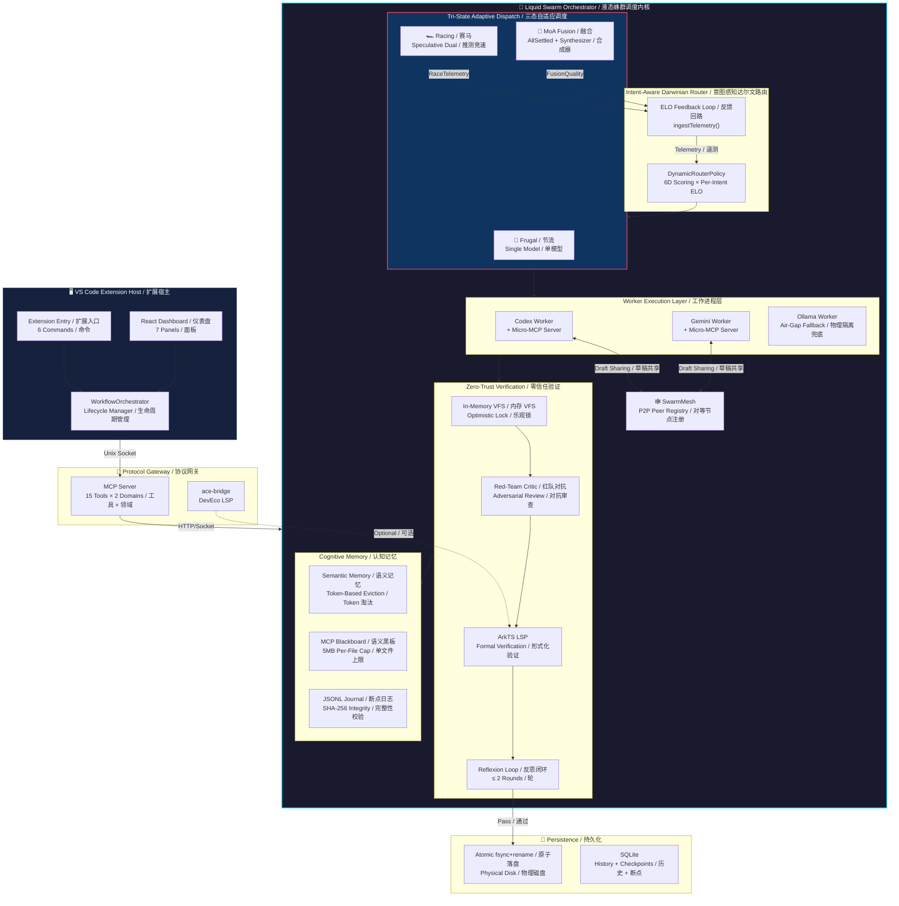
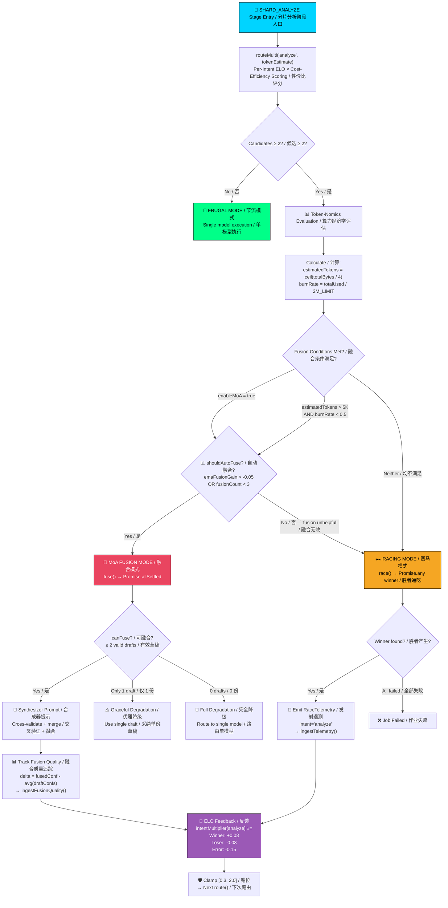
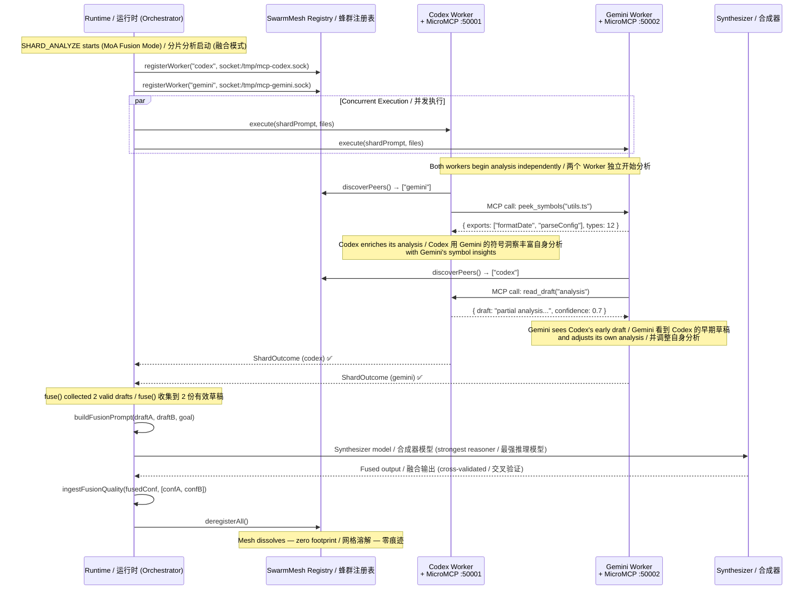

# Liquid Swarm Orchestrator — Architecture Whitepaper / 架构白皮书

> **Antigravity AI v0.3.0 | March 2026**
> Internal code name: `antigravity-taskd` | Production identity / 生产身份: **Liquid Swarm Orchestrator (液态蜂群调度内核)**

---

## Table of Contents / 目录

1. [Executive Summary / 概述](#executive-summary--概述)
2. [Global Neural Topology / 全域液态神经拓扑图](#1-global-neural-topology--全域液态神经拓扑图)
3. [Pipeline Lifecycle / 管线生命周期](#2-pipeline-lifecycle--管线生命周期)
4. [Token-Nomics Dispatch Decision Tree / Token-Nomics 调度决策树](#3-token-nomics-dispatch-decision-tree--token-nomics-调度决策树)
5. [A2A P2P Mesh Interaction / A2A 点对点网格交互](#4-a2a-p2p-mesh-interaction--a2a-点对点网格交互)
6. [Per-Intent ELO Routing / 每意图 ELO 路由](#5-per-intent-elo-routing--每意图-elo-路由)
7. [Security & Isolation / 安全与隔离](#6-security--isolation--安全与隔离)
8. [Design Principles / 设计原则](#7-design-principles--设计原则)

---

## Executive Summary / 概述

The Liquid Swarm Orchestrator (LSO) is the cognitive kernel powering Antigravity AI. It implements a **6-stage pipeline** that transforms a high-level user goal into verified, atomically-committed code changes — orchestrating multiple AI models across heterogeneous backends (Codex CLI, Gemini CLI, Ollama) with zero human intervention.

Liquid Swarm Orchestrator（LSO，液态蜂群调度内核）是 Antigravity AI 的认知核心。它实现了一条 **6 阶段流水线**，将高层用户目标转化为经验证的、原子提交的代码变更 — 跨异构后端（Codex CLI、Gemini CLI、Ollama）编排多个 AI 模型，全程零人工干预。

### What makes LSO unique in the 2026 landscape / LSO 在 2026 年格局中的独特之处

| Capability / 能力 | Implementation / 实现 | SOTA Comparison / SOTA 对标 |
|------------|---------------|-----------------|
| **Tri-State Adaptive Dispatch / 三态自适应调度** | Runtime morphing: Frugal / Racing / Fusion / 运行时变形 | Together AI MoA (static 3-layer only / 仅静态 3 层) |
| **Per-Intent ELO / 每意图 ELO** | `intentMultiplier[intent]` with EMA feedback / EMA 反馈 | No known peer / 业界无对标 |
| **Speculative Racing / 推测性赛马** | `Promise.any` + per-candidate `AbortController` | Google speculative decoding (LLM-internal only) |
| **P2P Agent Mesh / P2P 智能体网格** | Unix socket Micro-MCP servers per Worker | CrewAI (centralized blackboard only / 仅中心化黑板) |
| **Neuro-Symbolic Reflexion / 神经符号反思** | Red-Team + ArkTS LSP formal verification / 红队 + 形式化验证 | Reflexion paper (no formal verification / 无形式化验证) |
| **Fusion Quality Auto-Disable / 融合质量自动禁用** | `emaFusionGain` tracking + self-kill switch / 自杀开关 | No known implementation / 业界无实现 |

---

## 1. Global Neural Topology / 全域液态神经拓扑图

The following diagram shows the macro-level architecture — from the VS Code host process through the Protocol Gateway, down to the Liquid Swarm Orchestrator's cognitive subsystems.

下图展示宏观架构 — 从 VS Code 宿主进程，经由协议网关，到液态蜂群调度内核的认知子系统。



---

## 2. Pipeline Lifecycle / 管线生命周期

Every job traverses 6 stages. The pipeline is **interruptible** at any stage boundary — the JSONL journal enables crash recovery from the last completed stage.

每个作业经历 6 个阶段。管线在任何阶段边界均可**中断** — JSONL 日志支持从最后完成阶段崩溃恢复。

```
┌─────────────────────────────────────────────────────────────────────┐
│                                                                     │
│  SCOUT ──→ SHARD_ANALYZE ──→ AGGREGATE ──→ VERIFY ──→ WRITE ──→ ✅ │
│    │            │                │            │          │           │
│    │       ┌────┴────┐           │       ┌────┴────┐     │           │
│    │       │ Racing  │           │       │  VFS    │     │           │
│    │       │   OR    │           │       │ + LSP   │     │           │
│    │       │ Fusion  │           │       │ + Red   │     │           │
│    │       └─────────┘           │       │  Team   │     │           │
│    │                             │       └─────────┘     │           │
│  Journal                       Journal                 Journal      │
│  断点日志                       断点日志                断点日志     │
│                                                                     │
└─────────────────────────────────────────────────────────────────────┘
```

### Stage Details / 阶段详情

| Stage / 阶段 | Input / 输入 | Output / 输出 | Key Mechanism / 核心机制 |
|-------|-------|--------|--------------|
| **SCOUT / 侦察** | User goal + workspace / 用户目标 + 工作区 | `ScoutManifest` (文件列表 + 分片策略) | Single-model routing / 单模型路由 `route('scout')` |
| **SHARD_ANALYZE / 分片分析** | Manifest + source files / 清单 + 源文件 | `ShardAnalysis[]` | **Tri-State Dispatch / 三态调度** (see §3) |
| **AGGREGATE / 聚合** | All shard results / 所有分片结果 | `AggregateResult` | Merkle root verification / Merkle 根校验 + 结果合并 |
| **VERIFY / 验证** | Proposed changes / 拟议变更 | Validated changes / 已验证变更 | VFS → Red-Team → LSP → Reflexion (≤2 rounds / 轮) |
| **WRITE / 写入** | Verified changes / 已验证变更 | Committed files / 已提交文件 | `fsync + rename` atomic disk write / 原子落盘 |
| **FINALIZE / 定稿** | Job metadata / 作业元数据 | `COMPLETED` status | Governance audit trail / 治理审计日志 |

---

## 3. Token-Nomics Dispatch Decision Tree / Token-Nomics 调度决策树

This is the brain of the Tri-State Adaptive Swarm — the decision logic that determines whether a SHARD stage uses Frugal, Racing, or MoA Fusion mode.

这是三态自适应蜂群的大脑 — 决定 SHARD 阶段使用节流、赛马还是 MoA 融合模式的决策逻辑。



### Scoring Formula / 评分公式

```
finalScore = staticScore × intentMultiplier[currentIntent] × costEfficiencyFactor

where / 其中:
  staticScore = Σ(dimensionScore × intentWeight)    // 6 dimensions × 4 intents / 6 维 × 4 意图
  intentMultiplier ∈ [0.3, 2.0]                     // Per-intent EMA evolution / 每意图 EMA 演化
  costEfficiencyFactor = max(0.7, 1.0 - 0.1 × (emaCostPerCall / 8K - 1))  // 性价比因子
```

---

## 4. A2A P2P Mesh Interaction / A2A 点对点网格交互

This sequence diagram shows how concurrent Worker processes use the **Micro-MCP Mesh** to perform cross-process draft sharing during a SHARD stage.

此序列图展示并发 Worker 进程如何使用**微型 MCP 网格**在 SHARD 阶段进行跨进程草稿共享。



### Key Design Constraints / 关键设计约束

- **Ephemeral Lifecycle / 临时生命周期**: The mesh exists only during a single job's SHARD stage. No persistent state leaks. 网格仅在单个作业的 SHARD 阶段存在，无状态泄漏。
- **Non-Blocking Discovery / 非阻塞发现**: `discoverPeers()` is lock-free and returns immediately. 无锁，立即返回。
- **Draft Versioning / 草稿版本化**: `read_draft` returns the latest available snapshot. 返回最新可用快照。
- **Unidirectional Influence / 单向影响**: Draft sharing is advisory only. A worker is never forced to incorporate peer insights. 草稿共享仅供参考，Worker 永远不被强制采纳对等洞察。

---

## 5. Per-Intent ELO Routing / 每意图 ELO 路由

### The Problem with Global ELO / 全局 ELO 的问题

Traditional ELO systems assign **one score per model**. This creates a critical flaw:

传统 ELO 系统给每个模型分配**一个全局分数**。这造成了严重缺陷：

> If Codex is fast at `generate` but slow at `analyze`, a global multiplier cannot capture both. Winning at `generate` inflates its `analyze` score, causing incorrect routing.
>
> 如果 Codex 在 `generate` 上很快但在 `analyze` 上很慢，全局乘数无法同时捕获两者。在 `generate` 上获胜会膨胀其 `analyze` 评分，导致错误路由。

### Our Solution: Intent-Dimensional ELO / 我们的方案：意图维度 ELO

```typescript
interface ModelEloState {
  intentMultiplier: Record<TaskIntent, number>
  //  scout: 1.2    ← Codex is good at scouting / Codex 擅长侦察
  //  analyze: 0.7  ← but slow at analysis / 但分析慢（不污染 scout）
  //  generate: 1.8 ← exceptional at code gen / 代码生成卓越
  //  verify: 1.0   ← neutral at verification / 验证中立
  
  emaCostPerCall: number     // EMA smoothed token cost / EMA 平滑 Token 成本
  totalTokensConsumed: number // Cumulative tracking / 累计追踪
}
```

### Feedback Loop / 反馈回路

```
Race completes / 赛马完成 → RaceTelemetry { intent: 'analyze', candidates: [...] }
                                    │
                                    ▼
                          ingestTelemetry(telemetry)
                                    │
                          ┌─────────┼─────────┐
                          ▼         ▼         ▼
                     Update     Update    Update only
                     EMA        token     intentMultiplier
                     latency    cost      ['analyze'] ONLY
                     全局延迟    Token 成本  仅 analyze 意图
                                    │
                                    ▼
                          Clamp to [0.3, 2.0] / 钳位
```

---

## 6. Security & Isolation / 安全与隔离

| Layer / 层 | Mechanism / 机制 | Guarantee / 保证 |
|-------|-----------|-----------|
| **Process Isolation / 进程隔离** | Each Worker in separate Node.js process / 每个 Worker 独立进程 | Worker crash doesn't kill orchestrator / Worker 崩溃不影响调度器 |
| **VFS Sandbox / VFS 沙箱** | All changes through in-memory VFS / 所有变更经内存 VFS | No partial writes / 无残缺写入 |
| **Secrets Scrubbing / 秘密脱敏** | 9 regex patterns intercept secrets / 9 种正则拦截 | Zero exfiltration / 零数据外泄 |
| **Memory Eviction / 记忆淘汰** | Token-based eviction in SemanticMemoryStore / 基于 Token 淘汰 | Prevents OOM / 防止 OOM |
| **Token Circuit Breaker / Token 熔断器** | 2M global budget + `burnRate` / 200 万全局预算 | Prevents runaway costs / 防止成本失控 |
| **Journal Integrity / 日志完整性** | SHA-256 hash per stage / 每阶段 SHA-256 | Tamper-evident recovery / 防篡改恢复 |
| **Merkle Verification / Merkle 校验** | Deterministic shard hashing / 确定性分片哈希 | Proves completeness / 证明完整性 |
| **Network Fallback / 网络降级** | Ollama auto-detection / Ollama 自动检测 | 100% offline capability / 100% 离线能力 |
| **Ed25519 Identity / 加密身份** | Cryptographic signing / 加密签名 | Non-repudiable audit / 不可抵赖审计 |

---

## 7. Design Principles / 设计原则

1. **Fail Narrow, Not Wide / 窄故障，非宽故障**: Every failure is contained to its scope — a Worker crash doesn't kill the job, a fusion failure degrades to racing, racing failure degrades to single-model. 每个故障被限制在其作用域内 — Worker 崩溃不杀作业，融合失败降级为赛马，赛马失败降级为单模型。

2. **Measure Before You Trust / 量化先于信任**: No model output is accepted without measurement. ELO scores are earned, not configured. Fusion is earned through quality delta, not assumed. 模型输出必须经过量化才被采信。ELO 分数靠实力赢得，不靠配置。融合价值靠质量增量证明，不靠假设。

3. **Evolve, Don't Configure / 进化，非配置**: The system should get better over time without manual tuning. Per-Intent ELO, fusion auto-disable, and cost-efficiency factors all operate autonomously. 系统应随时间自动变优，无需手动调参。每意图 ELO、融合自动禁用、性价比因子均自主运行。

4. **Zero Footprint / 零痕迹**: The P2P mesh, VFS sandbox, and Worker processes all exist ephemerally. 所有临时构件（P2P 网格、VFS 沙箱、Worker 进程）仅在作业生命周期内存在。

5. **Air-Gap Ready / 物理隔离就绪**: Every cloud dependency has a local fallback. The system must function at 100% capability in a physically isolated network. 每个云端依赖都有本地兜底。系统必须在物理隔离网络中保持 100% 能力。

---

<div align="center">

*This document describes the architecture of Antigravity AI v0.3.0 as of March 2026.*

*本文档描述 Antigravity AI v0.3.0 架构，截至 2026 年 3 月。*

*The Liquid Swarm Orchestrator — where agents don't just execute, they evolve.*

*液态蜂群调度内核 — 智能体不只是执行，更在进化。*

</div>
