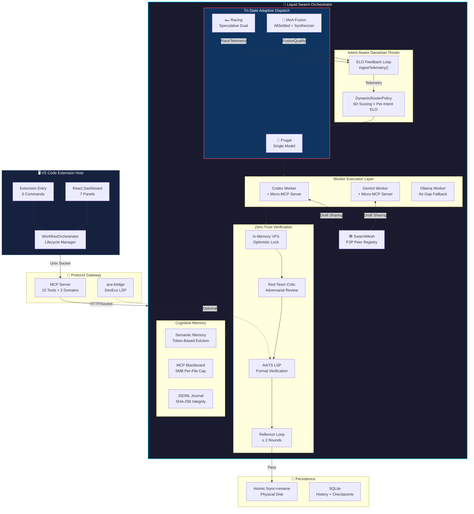
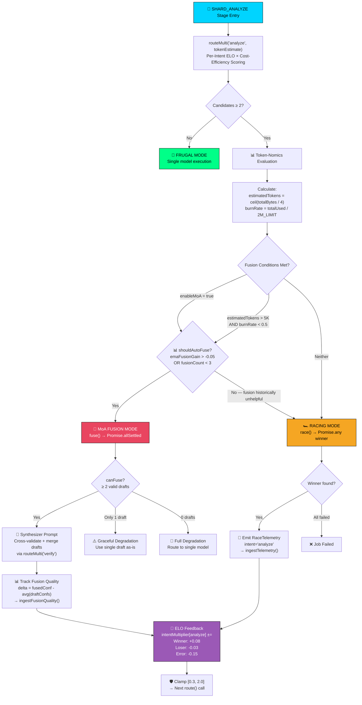
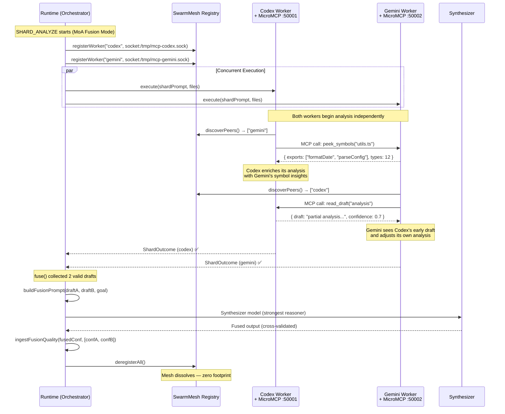

# Liquid Swarm Orchestrator — Architecture Whitepaper

> **Antigravity AI v0.3.0 | March 2026**
> Internal code name: `antigravity-taskd` | Production identity: **Liquid Swarm Orchestrator (LSO)**

---

## Table of Contents

1. [Executive Summary](#executive-summary)
2. [Global Neural Topology](#1-global-neural-topology)
3. [Pipeline Lifecycle — SCOUT to WRITE](#2-pipeline-lifecycle)
4. [Token-Nomics Driven Dispatch Decision Tree](#3-token-nomics-dispatch-decision-tree)
5. [Agent-to-Agent (A2A) P2P Mesh Interaction](#4-a2a-p2p-mesh-interaction)
6. [Per-Intent ELO Routing Deep Dive](#5-per-intent-elo-routing)
7. [Security & Isolation](#6-security--isolation)
8. [Design Principles](#7-design-principles)

---

## Executive Summary

The Liquid Swarm Orchestrator (LSO) is the cognitive kernel powering Antigravity AI. It implements a **6-stage pipeline** that transforms a high-level user goal into verified, atomically-committed code changes — orchestrating multiple AI models across heterogeneous backends (Codex CLI, Gemini CLI, Ollama) with zero human intervention.

What makes LSO unique in the 2026 multi-agent landscape:

| Capability | Implementation | SOTA Comparison |
|------------|---------------|-----------------|
| **Tri-State Adaptive Dispatch** | Runtime morphing between Frugal/Racing/Fusion | Together AI MoA (static 3-layer only) |
| **Per-Intent ELO** | `intentMultiplier[intent]` with EMA feedback | No known peer implementation |
| **Speculative Racing** | `Promise.any` with per-candidate `AbortController` | Google speculative decoding (LLM-internal only) |
| **P2P Agent Mesh** | Unix socket Micro-MCP servers per Worker | CrewAI (centralized blackboard only) |
| **Neuro-Symbolic Reflexion** | Red-Team critic + ArkTS LSP formal verification | Reflexion paper (no formal verification) |
| **Fusion Quality Auto-Disable** | `emaFusionGain` tracking + self-kill switch | No known implementation |

---

## 1. Global Neural Topology

The following diagram shows the macro-level architecture — from the VS Code host process through the Protocol Gateway, down to the Liquid Swarm Orchestrator's cognitive subsystems.



---

## 2. Pipeline Lifecycle

Every job traverses 6 stages. The pipeline is **interruptible** at any stage boundary — the JSONL journal enables crash recovery from the last completed stage.

```
┌─────────────────────────────────────────────────────────────────────┐
│                                                                     │
│  SCOUT ──→ SHARD_ANALYZE ──→ AGGREGATE ──→ VERIFY ──→ WRITE ──→ ✅ │
│    │            │                │            │          │           │
│    │       ┌────┴────┐           │       ┌────┴────┐     │           │
│    │       │ Racing  │           │       │  VFS    │     │           │
│    │       │   OR    │           │       │ + LSP   │     │           │
│    │       │ Fusion  │           │       │ + Red   │     │           │
│    │       └─────────┘           │       │  Team   │     │           │
│    │                             │       └─────────┘     │           │
│  Journal                       Journal                 Journal      │
│  Checkpoint                    Checkpoint              Checkpoint   │
│                                                                     │
└─────────────────────────────────────────────────────────────────────┘
```

### Stage Details

| Stage | Input | Output | Key Mechanism |
|-------|-------|--------|--------------|
| **SCOUT** | User goal + workspace | `ScoutManifest` (file list + shard strategy) | Single-model routing via `route('scout')` |
| **SHARD_ANALYZE** | Manifest + source files | `ShardAnalysis[]` | **Tri-State Dispatch** (see §3) |
| **AGGREGATE** | All shard results | `AggregateResult` | Merkle root verification + result merging |
| **VERIFY** | Proposed code changes | Validated changes | VFS → Red-Team → LSP → Reflexion (≤2 rounds) |
| **WRITE** | Verified changes | Committed files | `fsync + rename` atomic disk write |
| **FINALIZE** | Job metadata | `COMPLETED` status | Governance audit trail emission |

---

## 3. Token-Nomics Dispatch Decision Tree

This is the brain of the Tri-State Adaptive Swarm — the decision logic that determines whether a SHARD stage uses Frugal, Racing, or MoA Fusion mode.



### Scoring Formula

```
finalScore = staticScore × intentMultiplier[currentIntent] × costEfficiencyFactor

where:
  staticScore = Σ(dimensionScore × intentWeight)    // 6 dimensions × 4 intents
  intentMultiplier ∈ [0.3, 2.0]                     // Per-intent EMA evolution
  costEfficiencyFactor = max(0.7, 1.0 - 0.1 × (emaCostPerCall / 8K - 1))
```

---

## 4. A2A P2P Mesh Interaction

This sequence diagram shows how concurrent Worker processes use the **Micro-MCP Mesh** to perform cross-process draft sharing during a SHARD stage.



### Key Design Constraints

- **Ephemeral Lifecycle**: The mesh exists only during a single job's SHARD stage. No persistent state leaks between jobs.
- **Non-Blocking Discovery**: `discoverPeers()` is lock-free and returns immediately. If no peers are registered yet, the worker proceeds solo.
- **Draft Versioning**: `read_draft` returns the latest available snapshot — workers can call it multiple times as their analysis evolves.
- **Unidirectional Influence**: Draft sharing is advisory only. A worker is never forced to incorporate peer insights.

---

## 5. Per-Intent ELO Routing

### The Problem with Global ELO

Traditional ELO systems assign **one score per model**. This creates a critical flaw:

> If Codex is fast at `generate` but slow at `analyze`, a global multiplier cannot capture both. Winning at `generate` inflates its `analyze` score, causing it to be incorrectly preferred for analysis tasks.

### Our Solution: Intent-Dimensional ELO

```typescript
interface ModelEloState {
  intentMultiplier: Record<TaskIntent, number>
  //  scout: 1.2    ← Codex is good at scouting
  //  analyze: 0.7  ← but slow at analysis (doesn't contaminate scout)
  //  generate: 1.8 ← and exceptional at code generation
  //  verify: 1.0   ← neutral at verification
  
  emaCostPerCall: number     // EMA smoothed token cost
  totalTokensConsumed: number // Cumulative tracking
}
```

### Feedback Loop

```
Race completes → RaceTelemetry { intent: 'analyze', candidates: [...] }
                        │
                        ▼
              ingestTelemetry(telemetry)
                        │
              ┌─────────┼─────────┐
              ▼         ▼         ▼
         Update only   Update    Update
         EMA latency   token     intentMultiplier
         (global)      cost      ['analyze'] ONLY
                        │
                        ▼
              Clamp to [0.3, 2.0]
```

---

## 6. Security & Isolation

| Layer | Mechanism | Guarantee |
|-------|-----------|-----------|
| **Process Isolation** | Each Worker runs in a separate Node.js child process | Worker crash cannot bring down the orchestrator |
| **VFS Sandbox** | All code changes go through in-memory VFS before disk | No partial writes, no corrupted files |
| **Secrets Scrubbing** | 9 regex patterns intercept secrets before LLM context | Zero data exfiltration to external APIs |
| **Memory Eviction** | Token-based eviction in SemanticMemoryStore | Prevents OOM during long-running analysis |
| **Token Circuit Breaker** | 2M global budget with `burnRate` monitoring | Prevents runaway costs |
| **Journal Integrity** | SHA-256 hash per checkpoint stage | Tamper-evident crash recovery |
| **Merkle Verification** | Deterministic shard hashing | Proves shard completeness |
| **Network Fallback** | Ollama auto-detection for air-gapped deployments | 100% offline capability |
| **Ed25519 Identity** | Cryptographic signing of governance events | Non-repudiable audit trail |

---

## 7. Design Principles

1. **Fail Narrow, Not Wide**: Every failure is contained to its scope — a Worker crash doesn't kill the job, a fusion failure degrades to racing, racing failure degrades to single-model.

2. **Measure Before You Trust**: No model output is accepted without measurement. ELO scores are earned, not configured. Fusion is earned through quality delta, not assumed.

3. **Evolve, Don't Configure**: The system should get better over time without manual tuning. Per-Intent ELO, fusion auto-disable, and cost-efficiency factors all operate autonomously.

4. **Zero Footprint**: The P2P mesh, VFS sandbox, and Worker processes all exist ephemerally. When a job completes, nothing persists except the intended output and the audit trail.

5. **Air-Gap Ready**: Every cloud dependency has a local fallback. The system must function at 100% capability in a physically isolated network.

---

<div align="center">

*This document describes the architecture of Antigravity AI v0.3.0 as of March 2026.*
*The Liquid Swarm Orchestrator — where agents don't just execute, they evolve.*

</div>
