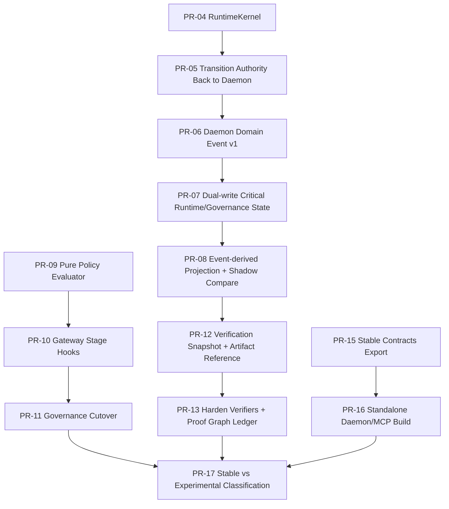

# Antigravity Workflow 按 PR 粒度实施计划

本文档基于根目录整改主文档《`ARCHITECTURE_AUDIT_AND_REMEDIATION.md`》整理，仅用于承载按 PR 粒度拆分的工程实施计划。本文档不重复审计背景，不重新定义整改总纲，只回答“按什么 PR 顺序、以什么边界、如何测试与回滚来落地”。

## A. 执行总策略

- 先修 correctness / trust / release，再处理高级能力和叙事收敛。
- 先抽 daemon authority kernel，再事件化关键语义，再治理主链化。
- 每个 PR 只解决一个主问题，避免把多个高风险主题粗暴合并。
- 高风险改动优先使用兼容层、双写迁移、影子校验和 feature flag。
- 先让主链变硬，再决定哪些研究件进入主链、哪些明确归入 `experimental`。
- 所有与 remote worker、artifact、governance 相关的 PR 都必须带反例测试，而不是只覆盖 happy path。
- 所有事件模型改动都要遵守“先 append canonical event，再保留 legacy projection”的迁移顺序。
- 所有协议与 artifact schema 改动都必须标记兼容策略和回滚面。
- 文档、导出契约、发布物边界的整改只能在对应代码边界已经收敛后进入仓库。

## B. PR 拆分总览

| PR 编号 | PR 标题 | 优先级 | 目标 | 涉及模块 | 前置依赖 | 风险等级 | 是否可并行 |
|---|---|---|---|---|---|---|---|
| PR-01 | Fix VERIFY challenger model identity semantics | P0 | 修复 `VERIFY` 证据链中的伪模型身份 | `antigravity-model-core`, `antigravity-daemon` | 无 | 低 | 是 |
| PR-02 | Align callback auth advertisement with runtime callback lease | P0 | 让 callback advertisement 与运行时 auth surface 一致 | `antigravity-daemon/remote-worker`, `server`, schema | 无 | 中 | 是 |
| PR-03 | Enforce callback freshness and replay protection | P0 | 增加 callback freshness window 与 anti-replay | `antigravity-daemon/remote-worker` | PR-02 | 中 | 否 |
| PR-04 | Introduce AuthorityRuntimeKernel and lifecycle contracts | P0 | 抽出单一 daemon lifecycle kernel | `antigravity-daemon/runtime`, `run-bootstrap`, `workflow-run-driver` | 无 | 中 | 是 |
| PR-05 | Move transition and skip authority back into daemon runtime | P0 | 把 transition/skip/forceQueue 从 driver 迁回 daemon | `antigravity-daemon`, `antigravity-model-core` | PR-04 | 中 | 否 |
| PR-06 | Define daemon domain event v1 and append contract | P0 | 建立 daemon domain event taxonomy 与 schema v1 | `antigravity-daemon/schema`, `antigravity-shared`, `persistence` | PR-04 | 中 | 是 |
| PR-07 | Dual-write completion sessions, receipts, handoffs, skips, and verdicts to event log | P0 | 将关键 side-table 语义双写进 event log | `antigravity-daemon/runtime`, `ledger`, `event-store` | PR-05, PR-06 | 高 | 否 |
| PR-08 | Add event-derived projection and shadow-compare path | P1 | 建立 event-derived projection 与 legacy shadow compare | `antigravity-daemon/projection`, `runtime`, `run-verifier` | PR-07 | 高 | 否 |
| PR-09 | Extract DaemonPolicyEngine into pure evaluator and facts adapter | P1 | 为 governance 主链化降低耦合 | `antigravity-daemon/policy-engine`, `antigravity-core/governance` | PR-04 | 中 | 是 |
| PR-10 | Add GovernanceGateway stage hooks for daemon lifecycle | P1 | 在 daemon lifecycle 中接入 gateway stages | `antigravity-core/governance`, `antigravity-daemon/runtime` | PR-09 | 高 | 否 |
| PR-11 | Cut over release and human-gate decisions to GovernanceGateway | P1 | 用统一 gateway 接管 release/human-gate 主链 | `antigravity-daemon/runtime`, `policy verdict flow` | PR-10 | 高 | 否 |
| PR-12 | Introduce verification snapshot and artifact reference model | P1 | 建立统一 verification snapshot / artifact ref | `antigravity-daemon/release-*`, `run-verifier`, schema | PR-08 | 高 | 是 |
| PR-13 | Harden artifact verifiers and bind transparency ledger to proof graph | P1 | 强化 artifact 语义绑定和 transparency ledger | `release-artifact-verifier`, `transparency-ledger`, `release-*` | PR-12 | 高 | 否 |
| PR-14 | Add strict trust mode and verified-set delegation | P1 | 收紧 trust 默认面与委派入口 | `trust-registry`, `remote-worker`, manifest/schema | PR-03 | 高 | 是 |
| PR-15 | Publish stable contracts and remove cross-package src imports | P1 | 收敛包边界，消除内部路径依赖 | `antigravity-core`, `antigravity-persistence`, `antigravity-daemon` | 无 | 中 | 是 |
| PR-16 | Split daemon and MCP into standalone build and release lanes | P1 | 形成 runtime-first 构建与发布链 | 根构建、CI、`daemon`, `mcp-server`, `vscode` | PR-15 | 中 | 否 |
| PR-17 | Classify stable versus experimental capabilities and realign docs | P1 | 落实 stable/experimental 收敛 | docs, README, package exports | PR-11, PR-13, PR-16 | 低 | 否 |
| PR-18 | Wire UpcastingEventStore into daemon read path after event v1 stabilization | P2 | 让 upcasting 成为真实读路径能力 | `persistence/event-store`, daemon init | PR-08 | 中 | 是 |
| PR-19 | Add RuntimeTelemetrySink and prepare OTel mainline wiring | P2 | 为主链观测引入稳定 telemetry sink | `antigravity-core/observability`, `daemon/runtime` | PR-04 | 中 | 是 |
| PR-20 | Freeze or scope VectorMemory and memory capabilities | P2 | 明确 memory 主链边界 | `persistence/memory`, docs | PR-17 | 中 | 是 |
| PR-21 | Reposition benchmark, interop, and formal capabilities and add boundary regressions | P2 | 对 benchmark / interop / formal 做定位收敛 | `daemon/benchmark*`, `interop-harness`, `spec`, docs | PR-17 | 低 | 是 |

## C. 每个 PR 的详细实施说明

### PR-01 Fix VERIFY challenger model identity semantics

1. PR 标题  
`fix(verify): bind challenger model identity to actual runtime model`

一句话版本的 commit / PR 描述：修复 `VERIFY` 节点输出中与真实模型调用不一致的 challenger 元数据，避免污染 evidence gate 与 distinct-family 校验。

类型：兼容性演进

2. 目标  
将 `VERIFY` 节点 output、receipt、evidence policy 中涉及 challenger model 的语义从硬编码改为真实调用结果派生。

3. 为什么先做它  
这是最小但高价值的 correctness 修复，不依赖其他主链改造，却直接影响 release evidence 真实性。

4. 主要改动范围  
- package：`antigravity-model-core`, `antigravity-daemon`
- 核心模块：
  - `node-executor` 中 `VerifyExecutor`
  - `workflow-output-contracts`
  - `evidence-policy`
  - 与 VERIFY 相关测试
- 接口 / schema：
  - VERIFY output 中的 `challengerModelId`
  - 如需要，补充 `challengerModelFamily`
- 文档影响：无公开协议变化

5. 本 PR 应该做什么  
- 将 `VerifyExecutor` 使用的 challenger model 元数据绑定到真实 `agentRuntime.ask()` 返回值。
- 让 output contract 校验真实使用的 model id/family。
- 调整 evidence gate 中 distinct-family 判断，优先使用真实 family。
- 补全 VERIFY 结果的单元与回归测试。

6. 本 PR 不应该做什么  
- 不引入新的 governance stage。
- 不修改 release artifact schema。
- 不改造 event model。

7. 依赖项  
无。

8. 风险点  
- 可能暴露现有测试依赖硬编码值。
- 如果 model family 推导规则不稳定，可能导致 distinct-family 误判。

9. 测试要求  
- 单元测试：VERIFY output contract、family 提取、distinct-family 判断。
- 集成测试：高 verifiability 场景下 evidence gate 使用真实 challenger identity。
- 回归测试：现有 VERIFY 流程与 `oracleResults` 不退化。
- 反例测试：challenger family 与 `PARALLEL` 家族相同时必须被阻断。

10. 验收标准  
- VERIFY output 中的 challenger model 字段来源于真实 runtime 调用结果。
- `evidence-policy` 不再依赖固定 `'deepseek'` 语义。
- 相关 release gate 测试全部通过。

11. 回滚策略  
- 如果兼容性问题过大，可暂时保留 legacy 字段，但新增 `actualChallengerModelId` 并让 verifier 优先读取新字段。

### PR-02 Align callback auth advertisement with runtime callback lease

1. PR 标题  
`fix(federation): align callback auth lease with verified agent-card advertisement`

一句话版本的 commit / PR 描述：让 callback lease 和 callback ingress 使用与 verified agent-card advertisement 完全一致的 auth surface。

类型：兼容性演进

2. 目标  
把 callback auth 变成真实协商后的协议事实，而不是“发现阶段读广告、运行阶段用常量”。

3. 为什么先做它  
这是所有 federation / callback 安全工作的前提。先对齐 surface，后面 freshness 和 strict trust 才有意义。

4. 主要改动范围  
- package：`antigravity-daemon`
- 核心模块：
  - `remote-worker`
  - callback ingress 处理
  - 相关 schema / manifest
- 接口 / schema：
  - `ResolvedTaskProtocol`
  - callback auth config surface
  - remote worker snapshot 字段
- 文档影响：
  - callback protocol 文档
  - manifest / API surface 说明

5. 本 PR 应该做什么  
- 抽出 `ResolvedCallbackAuthConfig`。
- 发现阶段解析并冻结 callback auth surface。
- 下发 callback lease 时使用 frozen config，而不是固定 header 常量。
- ingress 验签时基于该 frozen config 解析 header 和 signature encoding。
- 输出 remote worker snapshot 时暴露实际运行使用的 callback auth surface。

6. 本 PR 不应该做什么  
- 不引入 freshness window。
- 不引入 strict trust mode。
- 不改 discovery trust policy。

7. 依赖项  
无。

8. 风险点  
- 可能影响现有依赖固定 header 的测试或外部 worker。
- 需要小心处理“广告缺失字段但当前默认容忍”的兼容路径。

9. 测试要求  
- 单元测试：advertisement -> resolved callback auth config。
- 集成测试：callback lease 下发的 header/timestamp/encoding 与 resolved config 一致。
- 回归测试：callback 模式正常完成。
- 反例测试：广告缺失 callback 字段时 worker 被分类为 discovery issue 或降级。

10. 验收标准  
- 发现阶段校验通过的 callback auth 字段，与运行时 lease 和 ingress 验签完全一致。
- remote worker snapshot 能反映真实 callback auth surface。

11. 回滚策略  
- 如出现外部兼容问题，可在短期内引入 `compatFixedCallbackHeaders` 开关，保留旧行为，但默认关闭。

### PR-03 Enforce callback freshness and replay protection

1. PR 标题  
`feat(federation): enforce callback freshness window and replay protection`

一句话版本的 commit / PR 描述：为 remote callback 增加 timestamp freshness、duplicate delivery 拒绝和 replay 防护。

类型：feature flag

2. 目标  
让 callback ingress 从“格式可验签”提升为“具备时序与重放防护”的 authority 边界。

3. 为什么先做它  
PR-02 解决 surface 一致性后，PR-03 才能安全补 freshness 和 anti-replay 逻辑。

4. 主要改动范围  
- package：`antigravity-daemon`
- 核心模块：
  - `remote-worker`
  - callback token lifecycle
  - ingress timeline audit
- 接口 / schema：
  - callback skew config
  - duplicate callback result code / error surface
- 文档影响：
  - callback 安全说明

5. 本 PR 应该做什么  
- 引入 `maxCallbackSkewMs`。
- 对 callback timestamp 做 freshness 校验。
- 为 `callbackToken` 增加 replay cache 或 terminal receipt cache。
- 拒绝 duplicate delivery、stale delivery、skewed timestamp。
- 在 timeline 中记录 callback security rejection 原因。

6. 本 PR 不应该做什么  
- 不引入 strict trust mode。
- 不修改 remote worker discovery 策略。

7. 依赖项  
PR-02。

8. 风险点  
- 容易因时钟误差导致测试不稳定。
- 需要定义 duplicate delivery 的返回码和幂等性策略。

9. 测试要求  
- 单元测试：freshness window、clock skew、duplicate detection。
- 集成测试：callback 正常成功、过期 token、重复投递、同 token 不同 body。
- 回归测试：callback 正常模式不退化。
- 反例测试：未来时间戳、旧签名重放。

10. 验收标准  
- stale / skewed / replayed callback 均被拒绝。
- duplicate delivery 不会污染 authority 状态。
- 审计 timeline 中可见 callback rejection 分类原因。

11. 回滚策略  
- freshness 校验初始 behind flag；若出现兼容问题，可先关闭 strict freshness，仅保留 duplicate detection。

### PR-04 Introduce AuthorityRuntimeKernel and lifecycle contracts

1. PR 标题  
`refactor(runtime): introduce AuthorityRuntimeKernel and lifecycle contracts`

一句话版本的 commit / PR 描述：抽出 daemon authority runtime kernel，统一 bootstrap、drain、terminal、finalize 的生命周期边界。

类型：兼容性演进

2. 目标  
建立单一 lifecycle coordinator，为后续 authority 收敛、事件化和 governance stage 化提供稳定插槽。

3. 为什么先做它  
不先抽 kernel，后续 PR-05、PR-07、PR-10、PR-12 会继续在现有分叉结构上叠逻辑。

4. 主要改动范围  
- package：`antigravity-daemon`, `antigravity-model-core`
- 核心模块：
  - `runtime`
  - `run-bootstrap`
  - `workflow-run-driver`
  - `resume/recovery/finalize` 路径
- 接口：
  - lifecycle hook contract
  - active run context contract

5. 本 PR 应该做什么  
- 新增 `AuthorityRuntimeKernel` 或 `RuntimeLifecycleOrchestrator`。
- 明确 kernel 的生命周期：bootstrap、pre-drain、post-node, terminal-decision, finalize。
- 让 `runtime` 中的主逻辑调用 kernel，而不是散落在方法内部。
- `WorkflowRunDriver` 只保留执行泵职责，不改 authority 语义本身。

6. 本 PR 不应该做什么  
- 不迁移 transition authority。
- 不改 event model。
- 不主链化 governance。

7. 依赖项  
无。

8. 风险点  
- 生命周期抽象错误会让恢复路径变得更复杂。
- 容易把“抽象”做成单纯搬函数而非真实边界收敛。

9. 测试要求  
- 单元测试：kernel 生命周期调用顺序。
- 集成测试：start/replay/resume/cancel 仍可用。
- 回归测试：active run、drain、terminal snapshot 不变。

10. 验收标准  
- 存在单一 lifecycle coordinator 模块。
- `runtime` 中 bootstrap / drain / finalize 路径边界清晰。
- `WorkflowRunDriver` 仍可被调用，但 authority 生命周期由 daemon 统一协调。

11. 回滚策略  
- 保留旧路径一层适配函数，出现问题时可切回 legacy runtime entry，而不回滚文件结构。

### PR-05 Move transition and skip authority back into daemon runtime

1. PR 标题  
`refactor(runtime): move transition, skip, and force-queue decisions into daemon`

一句话版本的 commit / PR 描述：把 adaptive skip、forceQueue 和 transition authority 从 driver/executor 迁回 daemon kernel。

类型：一次性切换

2. 目标  
让节点推进、skip、route override 完全由 daemon authority 决定。

3. 为什么先做它  
PR-04 抽出 kernel 后，PR-05 是第一步真正去掉 driver 持有 authority 语义的改造。

4. 主要改动范围  
- package：`antigravity-daemon`, `antigravity-model-core`
- 核心模块：
  - `workflow-run-driver`
  - `node-executor`
  - `runtime`
  - `workflow-definition`
- 接口 / schema：
  - transition decision contract
  - skip detail contract

5. 本 PR 应该做什么  
- 将 `evaluateTransition()` 迁移到 daemon。
- driver 仅提交 node result，不自行调用 transition routing。
- daemon kernel 在 node completed 后统一计算 skip/forceQueue。
- adaptive skip 规则的 source-of-truth 收敛到 daemon definition / policy path。

6. 本 PR 不应该做什么  
- 不做 event dual-write。
- 不做 governance gateway 接线。
- 不重写 executor 业务逻辑。

7. 依赖项  
PR-04。

8. 风险点  
- adaptive skip 最容易回归。
- forceQueue 时机变化可能导致 timeline/phase 差异。

9. 测试要求  
- 单元测试：transition engine、adaptive skip rule。
- 集成测试：`PARALLEL -> skip DEBATE -> queue VERIFY`。
- 回归测试：`VERIFY -> HITL` 强制路径、正常全路径 strict-full。
- 反例测试：host/executor 返回的内容不能直接改变下一节点顺序。

10. 验收标准  
- driver 不再直接决定 skip/forceQueue。
- timeline 中与 skip 有关的记录只由 daemon path 产生。
- adaptive workflow 结果与原行为对齐或更严格。

11. 回滚策略  
- 保留旧 transition implementation 一次版本周期，通过内部 flag 切回 legacy transition path。

### PR-06 Define daemon domain event v1 and append contract

1. PR 标题  
`feat(event-model): define daemon domain event v1 and append contract`

一句话版本的 commit / PR 描述：建立 daemon domain event taxonomy、schema version 和 append contract，作为关键语义事件化的基础。

类型：兼容性演进

2. 目标  
为 daemon 侧运行/治理/artifact 语义建立统一事件模型，而不是继续把 side-table JSON 当隐式事实结构。

3. 为什么先做它  
PR-07 双写迁移、PR-08 projection 和 PR-18 upcasting 都建立在 PR-06 的事件词汇表之上。

4. 主要改动范围  
- package：`antigravity-daemon`, `antigravity-shared`, `antigravity-persistence`
- 核心模块：
  - daemon schema
  - event envelope / versioning
  - projector interface
- 接口 / schema：
  - daemon event envelope
  - daemon event payloads
  - schemaVersion 基线
- 文档影响：
  - 事件模型说明

5. 本 PR 应该做什么  
- 定义 daemon event categories：
  - completion session lifecycle
  - receipt recorded
  - handoff recorded
  - skip authorized
  - policy verdict recorded
  - tribunal recorded
  - artifact exported / verified
- 为这些事件定义 versioned payload schema。
- 约定 append contract 与 expected version 规则。

6. 本 PR 不应该做什么  
- 不切写入点。
- 不改 legacy ledger 逻辑。
- 不引入 upcasting read path。

7. 依赖项  
PR-04。

8. 风险点  
- 事件词汇表如果定义得太粗，会导致后续 projector 难用。
- 如果定义得太细，会造成一次 PR 过重。

9. 测试要求  
- 单元测试：schema parsing、event version 校验。
- 回归测试：append contract 不影响现有 event store 行为。

10. 验收标准  
- daemon domain event v1 有明确 envelope、payload、version。
- 后续 PR 可以直接基于新 event schema 做 dual-write。

11. 回滚策略  
- 该 PR 本身不切主路径写入，只要 schema 不被消费，即可低成本回滚。

### PR-07 Dual-write completion sessions, receipts, handoffs, skips, and verdicts to event log

1. PR 标题  
`feat(event-model): dual-write execution evidence and governance state to event log`

一句话版本的 commit / PR 描述：为 completion session、receipt、handoff、skip、policy verdict 建立 event log 双写，保留 legacy ledger projection。

类型：双写迁移

2. 目标  
让关键运行语义同时进入 append-only log，为 event-derived projection 和 replay 切换铺路。

3. 为什么先做它  
这是从“定义事件模型”跨到“开始使用事件模型”的第一步，也是 WS2 的核心迁移 PR。

4. 主要改动范围  
- package：`antigravity-daemon`, `antigravity-persistence`
- 核心模块：
  - `runtime`
  - `ledger`
  - event append path
  - recovery path
- 接口 / schema：
  - completion session events
  - evidence/governance events

5. 本 PR 应该做什么  
- 在现有 side-table 写入点同时 append daemon domain events。
- 保持 ledger 仍然正常写入，作为兼容 projection。
- 为双写增加监测和错误处理策略。
- 为后续 shadow compare 预留统一读取入口。

6. 本 PR 不应该做什么  
- 不切读路径。
- 不删除 legacy ledger tables。
- 不改 artifact verifier。

7. 依赖项  
PR-05、PR-06。

8. 风险点  
- 双写不一致。
- append 失败与 ledger 写入失败的事务顺序需要明确。
- recovery 期间可能读到部分双写数据。

9. 测试要求  
- 单元测试：每类 side effect 对应 event append。
- 集成测试：正常 run 完成后 event log 中存在对应 evidence/governance events。
- 回归测试：legacy ledger 路径不破坏现有 `verifyRun`。
- 反例测试：append 失败时不能让 snapshot 进入伪完成状态。

10. 验收标准  
- completion session / receipt / handoff / skip / verdict 在 event log 中可见。
- legacy ledger 仍维持现有对外行为。
- 双写过程出现错误时有明确失败语义和审计记录。

11. 回滚策略  
- 保留 dual-write 开关，可切回“仅 ledger”模式。
- 即使关闭 dual-write，不影响既有读路径。

### PR-08 Add event-derived projection and shadow-compare path

1. PR 标题  
`feat(replay): add event-derived projection and legacy shadow-compare path`

一句话版本的 commit / PR 描述：建立 event-derived projection，并与当前 legacy snapshot 组装结果做 shadow compare。

类型：feature flag

2. 目标  
在不切读路径的前提下，验证 event canonicalization 是否足以支撑完整 run 语义。

3. 为什么先做它  
PR-07 之后必须先做影子对比，不能立即切读，否则排障成本过高。

4. 主要改动范围  
- package：`antigravity-daemon`
- 核心模块：
  - `projection`
  - `refreshSnapshot`
  - `verifyRun`
  - recovery support
- 接口：
  - projection compare result
  - mismatch diagnostics

5. 本 PR 应该做什么  
- 实现 event-derived projection builder。
- 在 `refreshSnapshot` 中并行构建 legacy snapshot 与 event-derived snapshot。
- 记录 mismatch diagnostics，但暂不切换对外返回值。
- 在 `verifyRun` 中可选暴露 projection drift。

6. 本 PR 不应该做什么  
- 不删除 legacy snapshot path。
- 不引入 governance cutover。

7. 依赖项  
PR-07。

8. 风险点  
- 对比逻辑可能暴露大量现有 drift，需要控制噪音。
- 若 mismatch 输出过大，可能影响调试可读性。

9. 测试要求  
- 单元测试：projection builder。
- 集成测试：完整 run 后 legacy vs event-derived compare。
- 回归测试：中断恢复、skip、tribunal、artifact export 场景。
- 反例测试：人为篡改 side-table 但 event log 保持正确时，应能检测 drift。

10. 验收标准  
- 能够稳定输出 shadow compare 结果。
- 至少在主要 happy path 上 legacy 与 event-derived snapshot 一致。
- mismatch 有明确分类，不是泛泛的 JSON diff。

11. 回滚策略  
- compare path behind flag，可整体关闭，不影响现有读路径。

### PR-09 Extract DaemonPolicyEngine into pure evaluator and facts adapter

1. PR 标题  
`refactor(policy): extract DaemonPolicyEngine into pure evaluator and facts adapter`

一句话版本的 commit / PR 描述：将 `DaemonPolicyEngine` 收敛为纯规则评估后端与 facts adapter，为 gateway 主链化做准备。

类型：兼容性演进

2. 目标  
把当前 runtime 中散落的 `evaluateX` 调用背后的 policy 事实构建逻辑独立出来，使 policy engine 能作为纯 evaluator 被 gateway 调用。

3. 为什么先做它  
如果不先做这层解耦，PR-10 和 PR-11 只能继续复制旧分支逻辑。

4. 主要改动范围  
- package：`antigravity-daemon`, `antigravity-core`
- 核心模块：
  - `policy-engine`
  - facts builders
  - policy verdict adapter
- 接口：
  - evaluator interface
  - fact input contracts

5. 本 PR 应该做什么  
- 提取 pure evaluator。
- 提取 facts adapter / builder。
- 保留现有 `evaluateX` API 作为适配层，先不改调用点。

6. 本 PR 不应该做什么  
- 不切到 `GovernanceGateway`。
- 不修改 policy pack 格式。

7. 依赖项  
PR-04。

8. 风险点  
- 事实构建拆解时容易出现行为偏差。
- 旧 API 与新 evaluator 的兼容适配要保持完全对齐。

9. 测试要求  
- 单元测试：facts builder、pure evaluator。
- 回归测试：现有 `evaluateX` 行为不变。

10. 验收标准  
- `DaemonPolicyEngine` 的核心能力可以通过纯 evaluator 接口调用。
- 旧 `evaluateX` API 仍然可用且行为一致。

11. 回滚策略  
- 保留 legacy wrapper，必要时仍使用 wrapper，不回滚抽象层。

### PR-10 Add GovernanceGateway stage hooks for daemon lifecycle

1. PR 标题  
`feat(governance): add daemon lifecycle stage hooks to GovernanceGateway`

一句话版本的 commit / PR 描述：为 daemon lifecycle 引入 `preflight / authorize / observe / release` stage hooks，并让 runtime 可调用统一 gateway。

类型：兼容性演进

2. 目标  
把 gateway 扩展成 daemon 可真实消费的治理 stage orchestrator。

3. 为什么先做它  
PR-09 解决了 evaluator 解耦，PR-10 才能引入真正的 runtime stage hook。

4. 主要改动范围  
- package：`antigravity-core`, `antigravity-daemon`
- 核心模块：
  - `GovernanceGateway`
  - governance context types
  - daemon runtime lifecycle hook integration
- 协议 / schema：
  - governance stage metadata

5. 本 PR 应该做什么  
- 增加 daemon lifecycle 对应 stage types。
- 在 daemon runtime 中接入 stage hook，但先保留 direct policy path。
- 让 gateway 可以产出带 stage 的 policy verdict。

6. 本 PR 不应该做什么  
- 不移除 direct `evaluateX`。
- 不做 release/human-gate 最终 cutover。

7. 依赖项  
PR-09。

8. 风险点  
- stage 定义不当会导致后续 cutover 反复修改。

9. 测试要求  
- 单元测试：stage routing、fail-fast 顺序。
- 集成测试：preflight/authorize/observe hook 可被 daemon 调用。

10. 验收标准  
- gateway 已具备 daemon lifecycle stages。
- runtime 可调用 gateway stage hooks，但不破坏现有行为。

11. 回滚策略  
- gateway hooks behind flag，可暂时不启用，仅保留接口。

### PR-11 Cut over release and human-gate decisions to GovernanceGateway

1. PR 标题  
`refactor(governance): cut over release and human-gate decisions to GovernanceGateway`

一句话版本的 commit / PR 描述：将 release/human-gate/approval/resume 等主链治理决策切换到统一 gateway，并移除 direct policy branches。

类型：一次性切换

2. 目标  
让关键治理路径真正通过统一 PDP/PEP 模型运行。

3. 为什么先做它  
这是治理主链化真正生效的 PR；没有它，gateway 仍只是“可以调用”。

4. 主要改动范围  
- package：`antigravity-daemon`, `antigravity-core`
- 核心模块：
  - `runtime`
  - release gate / human gate / approval / resume 路径
  - `recordPolicyVerdict`
- 文档影响：
  - runtime governance contract

5. 本 PR 应该做什么  
- 将 release decision、human gate、approval、resume 改走 gateway。
- 删除 runtime 中相应 direct `policyEngine.evaluateX` 主分支。
- 统一 stage-tagged policy verdict 记录。

6. 本 PR 不应该做什么  
- 不同时修改 artifact schema。
- 不切换 strict trust mode。

7. 依赖项  
PR-10。

8. 风险点  
- release/human-gate 是主链关键路径，行为偏差代价大。
- 可能影响 paused/completed 切换时机。

9. 测试要求  
- 集成测试：release block、human gate required、resume、approval。
- 回归测试：strict-full / adaptive 两套 workflow。
- 反例测试：policy 明确 block 时，run 不能继续保持 completed。

10. 验收标准  
- release/human-gate 关键路径只走 gateway stage。
- runtime 不再保留等价 direct policy 分支。
- 相关 policy verdict 带明确 stage 信息。

11. 回滚策略  
- 保留 legacy branch 一次版本周期，可通过 internal flag 切回旧决策路径。

### PR-12 Introduce verification snapshot and artifact reference model

1. PR 标题  
`feat(artifacts): introduce verification snapshot and artifact reference model`

一句话版本的 commit / PR 描述：建立统一 verification snapshot 和 artifact reference，作为终态 artifact 的共同来源。

类型：兼容性演进

2. 目标  
为 attestation/report/dossier/bundle/certification 建立统一 proof graph 基础。

3. 为什么先做它  
不先统一 model，PR-13 的 verifier 强化只能继续沿用松散 payload binding。

4. 主要改动范围  
- package：`antigravity-daemon`
- 核心模块：
  - `run-verifier`
  - `release-attestation`
  - `policy-report`
  - `invariant-report`
  - `release-dossier`
  - `release-bundle`
  - `certification-record`
- schema：
  - verification snapshot
  - artifact references

5. 本 PR 应该做什么  
- 定义 `VerificationSnapshot`。
- 定义统一 `ArtifactReference`。
- 让各终态 artifact builder 从同一 snapshot 获取上游摘要，而不是各自重算。

6. 本 PR 不应该做什么  
- 不切换 verifier 为严格失败。
- 不修改 transparency ledger 逻辑。

7. 依赖项  
PR-08。

8. 风险点  
- schema 会影响多个 artifact 文件和 verifier。
- 需要控制 additive 兼容而非一次破坏性变更。

9. 测试要求  
- 单元测试：snapshot builder、artifact ref serializer。
- 集成测试：各 artifact 使用同一 snapshot source。
- 回归测试：现有 `get*` / `verify*` surface 仍可工作。

10. 验收标准  
- 所有终态 artifact 都引用统一 verification snapshot。
- artifact payload 中不再散落重复来源不一致的摘要字段。

11. 回滚策略  
- 采用 additive schema；若出问题，可继续用 legacy fields，暂不启用新 verifier 规则。

### PR-13 Harden artifact verifiers and bind transparency ledger to proof graph

1. PR 标题  
`feat(artifacts): harden verifiers and bind transparency ledger to proof graph`

一句话版本的 commit / PR 描述：强化 cross-artifact verifier，并让 transparency ledger 绑定 proof graph digest。

类型：一次性切换

2. 目标  
把 artifact 校验从“主要是 digest 校验”提升到“digest + upstream binding + verification snapshot binding + proof graph binding”。

3. 为什么先做它  
PR-12 给出了统一 snapshot；PR-13 才是真正把 release 体系做硬。

4. 主要改动范围  
- package：`antigravity-daemon`
- 核心模块：
  - `release-artifact-verifier`
  - `transparency-ledger`
  - `release-*`
- artifact schema：
  - verification snapshot digest
  - proof graph digest

5. 本 PR 应该做什么  
- 增加 cross-artifact consistency checks。
- 增加 `verificationSnapshotDigest` / `proofGraphDigest` 校验。
- transparency ledger entry 绑定 proof graph digest，而不只是 release bundle digest。
- 将 artifact verify 失败结果真正反馈到 release/human-gate path。

6. 本 PR 不应该做什么  
- 不引入非对称签名。
- 不重写 trust registry。

7. 依赖项  
PR-12。

8. 风险点  
- 现有 artifact fixture 和测试会有较大变更。
- 强校验可能导致旧 artifact 无法通过 verify。

9. 测试要求  
- 单元测试：cross-artifact matrix。
- 集成测试：artifact substitution、snapshot mismatch、dossier/bundle mismatch。
- 反例测试：篡改 trace bundle 后，下游 verify 全部失败。

10. 验收标准  
- 任一上游 artifact 被替换或与 snapshot 不一致，下游 verify 必须失败。
- transparency ledger 能反映同一 proof graph。

11. 回滚策略  
- verifier 强化先 behind flag 或双报告；如影响面过大，可先记录 warning，再升级为 blocking。

### PR-14 Add strict trust mode and verified-set delegation

1. PR 标题  
`feat(trust): add strict trust mode and verified-set delegation`

一句话版本的 commit / PR 描述：引入 strict trust mode，并让 remote delegation 只面向 verified worker 集合。

类型：feature flag

2. 目标  
让 trust surface 从“可用”走向“默认可硬化”。

3. 为什么先做它  
callback 安全面收紧后，需要从 discovery 和 delegation 两个入口统一收口。

4. 主要改动范围  
- package：`antigravity-daemon`
- 核心模块：
  - `trust-registry`
  - `remote-worker`
  - manifest/schema
- 协议 / 文档影响：
  - trust mode
  - remote worker list / discovery issues

5. 本 PR 应该做什么  
- 增加 `strictTrustMode`。
- 允许 dev / relaxed 与 strict policy profile 并存。
- delegate selector 只从 verified-set 选 worker。
- 未验证 worker 只出现在 discovery issues，不进入可委派集合。

6. 本 PR 不应该做什么  
- 不切 asymmetric signing。
- 不改 benchmark 外部定位。

7. 依赖项  
PR-03。

8. 风险点  
- 严格模式开启后可能让现有测试 worker 全部失效。
- 需要清楚区分 verified/warning/discovery issue 的行为边界。

9. 测试要求  
- 单元测试：strict policy resolution。
- 集成测试：strict 模式下 unsigned/expired/mismatched worker 被拒绝。
- 回归测试：relaxed 模式下现有开发体验保持可用。
- 反例测试：wrong issuer / rotation group / digest pin mismatch。

10. 验收标准  
- strict trust mode 下，未通过验证的 worker 不进入可委派集合。
- remote worker list / discovery issues 的分类与行为一致。

11. 回滚策略  
- strict 模式先 opt-in；出现兼容问题时退回 relaxed profile。

### PR-15 Publish stable contracts and remove cross-package src imports

1. PR 标题  
`refactor(packages): publish stable contracts and remove cross-package src imports`

一句话版本的 commit / PR 描述：为 core/persistence/daemon 建立稳定 contracts exports，移除跨包内部 `src` 导入。

类型：兼容性演进

2. 目标  
收敛包边界，为 daemon/MCP 独立构建与 runtime-first 发布打基础。

3. 为什么先做它  
不先清理包边界，PR-16 的独立构建和发布链会非常脆弱。

4. 主要改动范围  
- package：`antigravity-core`, `antigravity-persistence`, `antigravity-daemon`
- 核心模块：
  - contracts barrel exports
  - imports 替换
  - package exports / tsconfig references
- 文档影响：
  - 包使用方式

5. 本 PR 应该做什么  
- 将 `event-store`, `checkpoint-store`, `upcasting` 等稳定接口从 public exports 暴露。
- 替换 `@.../src/...` 导入。
- 清理 package.json exports / type resolution。

6. 本 PR 不应该做什么  
- 不改 runtime 行为。
- 不引入新 artifact schema。

7. 依赖项  
无。

8. 风险点  
- TypeScript path/export 变更容易影响构建。
- 可能暴露更多隐藏耦合。

9. 测试要求  
- 单元测试：barrel export smoke。
- 构建测试：typecheck / build 全绿。
- 回归测试：现有 test suite 全绿。

10. 验收标准  
- 仓库内无跨包 `src` 导入。
- 所有受影响 package 可独立 typecheck/build。

11. 回滚策略  
- 保留兼容 re-export 一次版本周期，必要时允许临时双路径导出。

### PR-16 Split daemon and MCP into standalone build and release lanes

1. PR 标题  
`build(release): split daemon and MCP into standalone build and release lanes`

一句话版本的 commit / PR 描述：拆分 daemon/MCP 的独立构建、烟测和发布链，为 runtime-first 产物铺路。

类型：兼容性演进

2. 目标  
让 daemon 与 MCP 成为一等产物，而不是 extension bundle 内部副产物。

3. 为什么先做它  
包边界收敛后，必须立即把构建和发布形态跟上，否则 runtime-first 只能停留在文档层。

4. 主要改动范围  
- package：根构建、CI、`antigravity-daemon`, `antigravity-mcp-server`, `antigravity-vscode`
- 核心模块：
  - build scripts
  - smoke scripts
  - release artifact naming
- 文档影响：
  - Quick Start / build / release 说明

5. 本 PR 应该做什么  
- 拆 build target：daemon、mcp-server、extension。
- 为 daemon/MCP 增加 standalone smoke。
- 保留现有 VSIX 构建链作为兼容。
- 形成 runtime-first release lane，但不要求立即替代现有分发。

6. 本 PR 不应该做什么  
- 不重写 extension 功能。
- 不切掉现有 VSIX 发布。

7. 依赖项  
PR-15。

8. 风险点  
- CI 变更容易引入构建不稳定。
- daemon entry / mcp entry 路径需要统一。

9. 测试要求  
- 构建测试：daemon/MCP/extension 各自独立 build。
- 集成测试：extension 可连接 standalone daemon。
- 回归测试：现有 package/install 行为不退化。

10. 验收标准  
- daemon 与 MCP 可独立构建并启动。
- CI 中存在独立 smoke。
- VSIX 产物仍然可用。

11. 回滚策略  
- 保留旧 build 脚本和旧 CI lane，必要时切回统一 bundle 流程。

### PR-17 Classify stable versus experimental capabilities and realign docs

1. PR 标题  
`docs(architecture): classify stable versus experimental capabilities`

一句话版本的 commit / PR 描述：将 cyclic/upcasting/otel/vector/formal/benchmark 等能力按 stable/experimental/frozen 分类，并同步文档与导出边界。

类型：一次性切换

2. 目标  
消除主文档、README、exports 和真实主链能力之间的灰区。

3. 为什么先做它  
必须在主链收敛和 artifact/trust 改造基本完成后再做，否则文档会再次漂移。

4. 主要改动范围  
- package：docs、README、`antigravity-core`, `antigravity-persistence`, `antigravity-daemon`
- 核心模块：
  - exports 分类
  - capability matrix
- 文档影响：
  - README
  - Architecture
  - Contract / Cookbook

5. 本 PR 应该做什么  
- 建立 stable / experimental / frozen capability matrix。
- 调整 README 和架构文档表述。
- 如有必要，调整 barrel exports。

6. 本 PR 不应该做什么  
- 不新增主链功能。
- 不在此 PR 顺手做 OTel / upcasting / vector memory 接线。

7. 依赖项  
PR-11、PR-13、PR-16。

8. 风险点  
- 文档和 exports 调整若不同步，容易再制造歧义。

9. 测试要求  
- 文档一致性检查。
- capability-boundary 回归测试。

10. 验收标准  
- README 和 exports 只声明真实 stable 能力。
- 未主链化能力都被显式标注为 experimental 或 frozen。

11. 回滚策略  
- 若文档影响过大，可先保留兼容说明页，但不回退能力分类本身。

### PR-18 Wire UpcastingEventStore into daemon read path after event v1 stabilization

1. PR 标题  
`feat(event-model): wire UpcastingEventStore into daemon read path`

一句话版本的 commit / PR 描述：在 daemon 读路径接入 upcasting 装饰器，使 schema evolution 成为真实能力。

类型：兼容性演进

2. 目标  
让 upcasting 从框架变成默认读路径能力。

3. 为什么先做它  
必须在 event v1 稳定并完成 shadow compare 后再接，否则只会引入额外复杂度。

4. 主要改动范围  
- `persistence/event-store`
- daemon initialize / load path
- upcasting registry initialization
- 测试 fixtures

5. 本 PR 应该做什么  
- 引入 daemon read path 的 upcasting wrapper。
- 至少实现一条真实 event version 升级链。
- 补 schema evolution 测试。

6. 本 PR 不应该做什么  
- 不重构 event taxonomy。

7. 依赖项  
PR-08。

8. 风险点  
- 老事件兼容问题。

9. 测试要求  
- 旧事件读取、新事件读取、混合事件流读取。

10. 验收标准  
- daemon 默认读路径已使用 upcasting wrapper。
- 真实旧版本事件可被读取并投影。

11. 回滚策略  
- 保留绕过 wrapper 的原始读取路径。

### PR-19 Add RuntimeTelemetrySink and prepare OTel mainline wiring

1. PR 标题  
`feat(observability): add RuntimeTelemetrySink for mainline tracing`

一句话版本的 commit / PR 描述：引入 runtime telemetry sink，先统一主链观测插口，再为 OTel 接线做准备。

类型：feature flag

2. 目标  
避免直接把当前 `DagEngineTracer` 粗暴接进主链，先建立稳定观测插口。

3. 为什么先做它  
直接上 OTel 容易在主链收敛前制造新的实验分支。

4. 主要改动范围  
- `antigravity-core/observability`
- `antigravity-daemon/runtime`
- 关键 lifecycle hooks

5. 本 PR 应该做什么  
- 定义 telemetry sink 接口。
- 在 daemon lifecycle 与 remote/artifact verify 路径打点。
- 默认 NoOp，实现不影响主链。

6. 本 PR 不应该做什么  
- 不直接引入 OTel SDK。

7. 依赖项  
PR-04。

8. 风险点  
- 打点插入点过多会影响可读性。

9. 测试要求  
- smoke test：开启/关闭 sink 都不影响行为。

10. 验收标准  
- daemon 主链存在统一 telemetry hook。

11. 回滚策略  
- sink 为可选依赖，可整体关闭。

### PR-20 Freeze or scope VectorMemory and memory capabilities

1. PR 标题  
`refactor(memory): freeze vector-memory path and scope stable memory capabilities`

一句话版本的 commit / PR 描述：冻结或收窄 vector memory 路径，只保留当前已落地的 episodic/semantic memory stable surface。

类型：一次性切换

2. 目标  
阻止 memory 能力继续以“已接主链”姿态扩散。

3. 为什么先做它  
memory 当前最容易被误判为已完成高级能力，需要尽早明确边界。

4. 主要改动范围  
- `persistence/memory`
- docs / exports

5. 本 PR 应该做什么  
- 将 vector memory 标记为 experimental 或冻结。
- 明确 stable memory surface 仅包含 `memorySearch`、episodic、semantic recall。

6. 本 PR 不应该做什么  
- 不接 embedding provider。
- 不让 memory 进入 runtime 决策。

7. 依赖项  
PR-17。

8. 风险点  
- 影响已有对 vector-memory 测试和文档理解。

9. 测试要求  
- export boundary test。
- stable memory surface regression。

10. 验收标准  
- vector memory 不再被表述为 stable 主能力。

11. 回滚策略  
- 仅为分类与导出收紧，必要时可恢复 export，但不应恢复主文档表述。

### PR-21 Reposition benchmark, interop, and formal capabilities and add boundary regressions

1. PR 标题  
`docs(testing): reposition benchmark, interop, and formal capabilities with boundary regressions`

一句话版本的 commit / PR 描述：将 benchmark、interop、formal 明确定位为内部回归/一致性资产，并补 capability boundary 回归测试。

类型：兼容性演进

2. 目标  
收敛 benchmark / interop / formal 的对外叙事，防止再次被误当作主链先进能力。

3. 为什么先做它  
这是主链收敛后的文档与回归补尾，不应早于 PR-17。

4. 主要改动范围  
- `daemon/benchmark*`
- `interop-harness`
- `spec`
- docs
- regression tests

5. 本 PR 应该做什么  
- 调整 capability 定位。
- 增加 stable vs experimental boundary regression。
- 明确 benchmark/interop/formal 当前面向内部回归而非外部评分。

6. 本 PR 不应该做什么  
- 不新建对外 benchmark 公共数据集。

7. 依赖项  
PR-17。

8. 风险点  
- 文档调整会影响外部预期，但不影响代码主路径。

9. 测试要求  
- benchmark/interop/formal boundary regression。

10. 验收标准  
- 这些能力的定位与主链状态一致。

11. 回滚策略  
- 主要是文档与测试层调整，可低成本回滚。

## D. 并行与串行关系图

### 必须串行的主链

原因：

- 这一串 PR 直接改变 authority runtime、事实源、governance 中枢化和 artifact 证明链，必须控制因果顺序。

### 可以并行推进的支线

- PR-01 可独立先做。
- PR-02 和 PR-04 可并行。
- PR-03 依赖 PR-02，但与 PR-04/PR-05 无强耦合。
- PR-09 可与 PR-08 并行推进，因为它主要是治理层解耦。
- PR-14 可在 PR-03 后独立推进，不阻塞 event canonicalization。
- PR-15 可独立推进，并作为 PR-16 的前置。
- PR-19 可在 PR-04 后并行，不影响主链 correctness。

### 建议延后的实验项

- PR-18 Upcasting 接线
- PR-19 RuntimeTelemetrySink / OTel 准备
- PR-20 VectorMemory 冻结/收窄
- PR-21 benchmark / interop / formal 定位调整

原因：

- 它们不解决当前最核心的 correctness / trust / release 问题。
- 过早推进会分散整改资源。

## E. 最推荐的提交顺序

1. 先做 PR-01，因为它成本低、收益高，能立即纠正 verification evidence 语义。
2. 接着做 PR-02，因为 callback 协议面必须先一致，后续才能谈 freshness 和 trust 强化。
3. 再做 PR-03，因为 freshness/replay 保护建立在一致的 callback surface 上。
4. 同时启动 PR-04，为后续所有主链收敛提供统一 lifecycle 边界。
5. 在 PR-04 落地后做 PR-05，把 transition/skip authority 从 driver 迁回 daemon。
6. PR-06 紧跟 PR-05，定义 daemon domain event v1，避免双写时事件模型再返工。
7. 做 PR-07，把 session/receipt/handoff/skip/verdict 双写进 event log，这是事件化的真正开始。
8. PR-07 之后立刻做 PR-08，只做 shadow compare，不急着切读，先暴露 drift。
9. PR-09 可以并行展开，为治理主链化做纯 evaluator 解耦。
10. PR-10 在 PR-09 后接入 gateway stage hooks，但先不移除旧分支。
11. PR-11 再做一次性 governance cutover，把 release/human-gate 关键路径切到 gateway。
12. PR-12 在 PR-08 基础上引入 verification snapshot 和 artifact ref，冻结 proof graph 基础。
13. PR-13 基于 PR-12 强化 verifier，并把 transparency ledger 绑定 proof graph。
14. PR-14 在 callback 收紧后开启 strict trust mode 和 verified-set delegation。
15. PR-15 作为包边界收敛项单独推进，不与 artifact/governance 大改混在一起。
16. PR-16 基于 PR-15 拆 daemon/MCP 独立构建和 runtime-first 发布链。
17. 等主链和发布边界基本稳定后，再做 PR-17，把 stable/experimental 分类正式写进文档和 exports。
18. 最后按资源情况推进 PR-18 ~ PR-21，这些属于高级能力接线或定位收尾。

## F. 第一阶段最小闭环

### 最小闭环包含的 PR

- PR-01
- PR-02
- PR-03
- PR-04
- PR-05
- PR-06
- PR-07
- PR-08
- PR-09
- PR-10
- PR-11
- PR-12
- PR-13
- PR-14

### 为什么这是一组最小闭环

- 它不追求 upcasting、OTel、vector memory、benchmark 对外化，也不强依赖 runtime-first 最终发布形态。
- 但它已经覆盖了当前最核心的四条硬化主线：
  - authority runtime 主链收敛
  - event log 开始成为关键事实源
  - governance 进入关键路径
  - callback / trust / artifact proof chain 明显变硬

### 完成后系统会发生的变化

- daemon 会更接近单一权威执行核心。
- release、human-gate、artifact verify 会更像运行时强依赖，而不是终态后处理拼装。
- remote worker callback 会从“签名可验”提升到“时序和重放都更硬”。
- event canonicalization 将从概念变成正在运行的迁移路径。
- proof surface 会从“工程可用”提升到“更接近强语义绑定”。

## G. 需要额外拆分的高风险 PR

### G.1 PR-07 建议拆成 3 个子 PR

- PR-07A：dual-write completion session lifecycle events  
  验收：pending/prepared/committed/applied 都有 event 记录。
- PR-07B：dual-write execution receipts / handoffs / skips  
  验收：运行证据类 side effects 都有 event log 对应项。
- PR-07C：dual-write policy verdicts / tribunal records  
  验收：治理和 judge 语义进入 event log。

原因：

- 这三类数据的写入时机、事务性和 recovery 影响面不同，不建议硬塞进一个超大 PR。

### G.2 PR-10 / PR-11 建议保持两阶段，而不是合并

- PR-10 只接入 gateway stage hooks，不改变最终 release decision source。
- PR-11 才做 release/human-gate cutover 和 legacy branch removal。

原因：

- 先接线、后切流更利于排查 gateway 行为偏差。

### G.3 PR-13 建议拆成 2 个子 PR

- PR-13A：cross-artifact verifier hardening  
  验收：artifact substitution / snapshot mismatch 都能被 detect。
- PR-13B：transparency ledger proof graph binding  
  验收：ledger entry 能引用统一 proof graph digest。

原因：

- verifier 强化和 ledger 模型收紧虽然同属 artifact proof chain，但前者偏运行时阻断，后者偏长期审计链，测试面不同。

### G.4 PR-16 建议拆成 2 个子 PR

- PR-16A：独立 build / smoke lanes  
  验收：daemon/MCP/extension 可独立构建。
- PR-16B：runtime-first release lane  
  验收：独立 runtime artifact 可产出，现有 VSIX 不受影响。

原因：

- 构建链拆分和发布链切换风险不同，应该先稳构建，再动发布。

### G.5 PR-17 建议不要混入 P2 接线项

- PR-17 只做分类与文档对齐。
- 不要在同一个 PR 顺手接入 upcasting、OTel、vector memory 或 benchmark 改造。

原因：

- 文档/分类 PR 的目标是收敛边界，不是新增能力；否则又会回到“叙事先于主链”的老问题。
