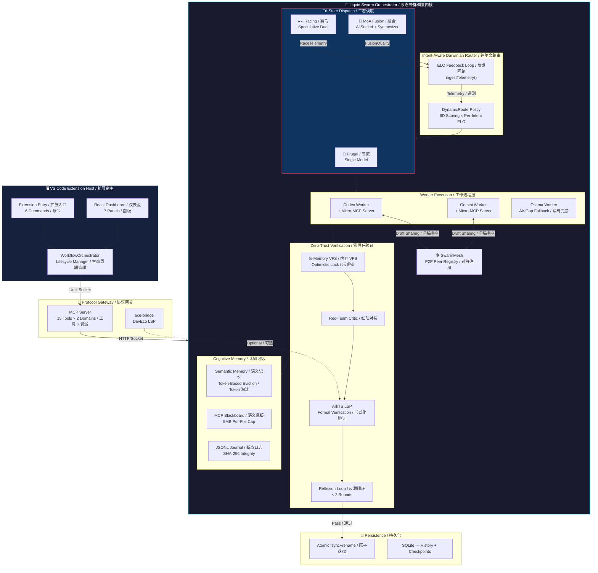
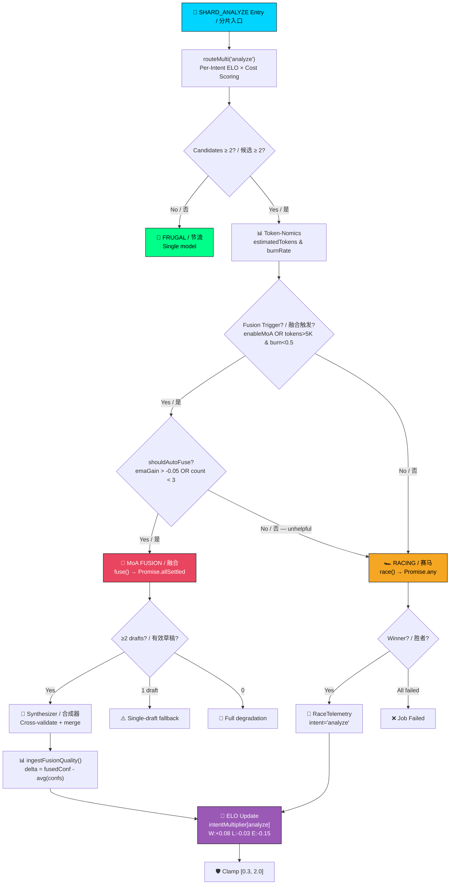

<div align="center">

# ⚡ Antigravity AI

### **The Next-Gen Liquid Agentic IDE**
### **新一代液态智能体 IDE**

*Powered by the **Liquid Swarm Orchestrator (液态蜂群调度内核)** — a cognitive kernel that thinks, races, fuses, and evolves.*

*驱动核心：**Liquid Swarm Orchestrator（液态蜂群调度内核）** — 一个会思考、竞速、融合并自我进化的认知引擎。*

[](./package.json)
[](./LICENSE)
[](https://www.typescriptlang.org/)
[](https://marketplace.visualstudio.com/)
[](https://modelcontextprotocol.io/)
[]()

</div>

---

> **"In 2026, an AI assistant that runs a single model on a single prompt is a toy. A system that orchestrates a swarm of heterogeneous agents — making them race, collaborate, cross-validate, and self-evolve — that is infrastructure."**
>
> **「在 2026 年，只用一个模型回答一条提示的 AI 助手是玩具。能让一群异构智能体竞速、协作、交叉验证并自我进化的系统，才是基础设施。」**

Antigravity AI is not another VS Code copilot. It is a **full-spectrum agentic operating system** that transforms your IDE into a living neural network of cooperating AI agents. At its core lies the **Liquid Swarm Orchestrator (液态蜂群调度内核)** — a cognitive kernel forged through 37 rounds of extreme architectural refinement — implementing capabilities that define the 2026 state of the art in multi-agent AI systems.

Antigravity AI 不是又一个 VS Code 副驾驶。它是一套**全谱系智能体操作系统**，将你的 IDE 变成由协作 AI 智能体组成的活体神经网络。其核心是 **Liquid Swarm Orchestrator（液态蜂群调度内核）** — 历经 37 轮极限架构锤炼的认知引擎 — 实现了定义 2026 年多智能体系统 SOTA 的核心能力。

### SOTA Comparison / SOTA 对标

| Capability / 能力 | Antigravity AI | Together AI MoA | CrewAI | Reflexion |
|---|---|---|---|---|
| Adaptive Dispatch / 自适应调度 | ✅ Tri-State Runtime Morphing | Static 3-Layer | ❌ | ❌ |
| Per-Intent ELO | ✅ 4-Intent × EMA | ❌ | ❌ | ❌ |
| Speculative Racing / 推测赛马 | ✅ `Promise.any` + AbortController | ❌ | ❌ | ❌ |
| P2P Agent Mesh / 智能体网格 | ✅ Unix Socket Micro-MCP | ❌ | Centralized Blackboard | ❌ |
| Formal Verification / 形式化验证 | ✅ ArkTS LSP Compiler | ❌ | ❌ | ❌ |
| Fusion Auto-Disable / 融合自禁 | ✅ `emaFusionGain` Kill Switch | ❌ | ❌ | ❌ |

---

## 🧬 The Five Pillars / 五大支柱

<table>
<tr>
<td width="20%" align="center">

### 🔀 Tri-State Adaptive Swarm
### 三态自适应蜂群
Token-Nomics driven shape-shifting<br/>算力经济学驱动的动态变形

</td>
<td width="20%" align="center">

### 🕸️ P2P Micro-MCP Mesh
### 去中心化微型 MCP 网格
Decentralized agent consciousness<br/>去中心化智能体意识共享

</td>
<td width="20%" align="center">

### 🛡️ Neuro-Symbolic Reflexion
### 零信任神经符号闭环
Zero-trust dual verification<br/>红蓝对抗 + 编译器形式化验证

</td>
<td width="20%" align="center">

### 🧠 Intent-Aware ELO Routing
### 意图感知达尔文路由
Darwinian self-evolution<br/>赛马遥测驱动的自适应权重演化

</td>
<td width="20%" align="center">

### 🔒 Air-Gapped Sandbox
### 军工级物理隔离沙箱
Military-grade isolation<br/>100% 本地无网降级

</td>
</tr>
</table>

---

### 🔀 Pillar 1 — Tri-State Adaptive Swarm / 三态自适应蜂群

The orchestrator doesn't pick a strategy — it **morphs** between three execution topologies in real-time based on Token-Nomics (computational economics).

调度内核不选策略 — 它根据 Token-Nomics（算力经济学）在三种执行拓扑之间**实时变形**。

```
                    ┌──────────────────────────────────────────┐
                    │         TOKEN-NOMICS EVALUATOR           │
                    │         算力经济学评估器                  │
                    │  estimatedTokens ─┐                      │
                    │  burnRate ─────────┤──→ EXECUTION SHAPE  │
                    │  enableMoA ───────┘                      │
                    └──────────────┬───────────────────────────┘
                                   │
              ┌────────────────────┼────────────────────┐
              ▼                    ▼                     ▼
    ┌─────────────────┐  ┌──────────────────┐  ┌──────────────────┐
    │  🚗 FRUGAL MODE │  │  🏎️ RACING MODE  │  │  🧬 MoA FUSION   │
    │     节流模式     │  │    赛马模式       │  │    融合模式       │
    │  Single-model   │  │  Speculative     │  │  Mixture-of-     │
    │  单体极速执行    │  │  multi-model     │  │  Agents output   │
    │  (cost ↓↓↓)     │  │  first-wins      │  │  synthesis       │
    │                 │  │  多路推测竞速     │  │  多模型输出融合   │
    │                 │  │  (latency ↓↓)    │  │  (quality ↑↑↑)   │
    └─────────────────┘  └──────────────────┘  └──────────────────┘
```

- **Frugal Mode / 节流模式**: Low complexity → single best model, zero waste. 低复杂度 → 调度最优单模型，零浪费。
- **Speculative Racing / 推测性赛马**: Dual-model `race()` with `Promise.any` semantics. First valid result wins, losers `abort()`ed mid-stream. 双模型竞速，第一个有效结果胜出，败者中途 `abort()`。
- **MoA Fusion / 混合专家融合**: High-complexity tasks trigger `fuse()` with `Promise.allSettled` — all drafts collected, then a **Synthesizer model** cross-validates and merges them. Includes 3-tier graceful degradation. 高复杂度 → 收集所有草稿 → **合成器模型**交叉验证融合。含三级优雅降级。

---

### 🕸️ Pillar 2 — P2P Micro-MCP Mesh / 去中心化微型 MCP 网格

Traditional multi-agent systems use a **centralized blackboard** — single point of failure. Antigravity AI breaks this with a **decentralized P2P mesh** over Unix Domain Sockets.

传统多智能体系统使用**中心化黑板** — 单点故障。Antigravity AI 用基于 Unix Socket 的**去中心化 P2P 网格**打破范式。

- Each Worker spawns a **Micro-MCP Server** (`read_draft` / `peek_symbols` / `write_feedback`). 每个 Worker 生成**微型 MCP 服务器**。
- Workers discover peers via `SwarmMesh` registry → **Subconscious Draft Sharing**: one agent peeks at another's in-progress analysis before either commits. Worker 通过 `SwarmMesh` 发现对等节点 → **潜意识草稿共享**。
- The mesh is **ephemeral** — zero footprint after job completion. 网格是**临时的** — 完成后零痕迹。

---

### 🛡️ Pillar 3 — Neuro-Symbolic Reflexion / 零信任神经符号闭环

LLMs are confidently wrong. Antigravity AI never trusts a single model's output.

大语言模型总是自信地犯错。Antigravity AI 绝不信任单一模型的输出。

1. **Semantic Red-Teaming / 语义红蓝对抗**: Heterogeneous adversarial model (`RedTeamCritic`) hunts logical flaws, security holes, hallucinated APIs. 异源对抗模型追猎逻辑缺陷、安全漏洞和幻觉 API。
2. **Formal Verification / 形式化验证**: Code → in-memory VFS (`optimistic-lock`) → **ArkTS LSP compiler** syntax/type check. 生成代码 → 内存 VFS → ArkTS LSP 编译器语法/类型验证。
3. **Reflexion Loop / 反思闭环**: Either check fails → bounded retry (max 2 rounds) with injected diagnostics → **100% logical + syntactic self-consistency**. 任一失败 → 有界重试（≤2 轮）→ **100% 逻辑 + 语法双重自洽**。

---

### 🧠 Pillar 4 — Intent-Aware ELO Routing / 意图感知达尔文路由

The router doesn't use static rankings. It **evolves** through Darwinian selection.

路由器不使用静态排名。它通过达尔文选择**自我进化**。

- **6-Dimensional Scoring / 6 维评分**: `code_quality × long_context × reasoning × speed × cost × chinese`, weighted by task intent. 根据任务意图加权。
- **Per-Intent ELO / 每意图独立 ELO**: Each model maintains 4 independent multipliers (`scout / analyze / generate / verify`). Codex dominating `generate` won't inflate its `verify` score. 每种意图独立乘数，互不污染。
- **Racing Telemetry → ELO Feedback / 赛马遥测 → ELO 反馈**: Winners `+0.08`, losers `-0.03`, errors `-0.15`, clamped `[0.3, 2.0]`. 每次赛马实时反馈路由器。
- **Cost-Efficiency Factor / 性价比因子**: High `emaCostPerCall` → proportional penalty. 高成本模型按比例惩罚。
- **Fusion Auto-Disable / 融合自动禁用**: `emaFusionGain < -0.05` after 3+ fusions → auto-disable, stop token waste. 融合连续无效 → 自动禁用。

---

### 🔒 Pillar 5 — Air-Gapped Sandbox / 军工级物理隔离沙箱

Deployable in military-grade air-gapped networks. 可部署在军工级物理隔离网络。

- **100% Local Ollama Fallback / 全本地化降级**: Network unreachable → seamless Ollama degradation. 网络不可达 → 无缝 Ollama 降级。
- **9-Pattern Secrets Scrubbing / 9 种正则脱敏**: Real-time interception of AWS keys, passwords, PII, etc. 实时拦截 AWS 密钥、密码、PII 等 9 类。
- **Anti-OOM Memory Eviction / 防 OOM 记忆淘汰**: Token-based eviction with configurable thresholds. 基于 Token 的可配置淘汰。
- **2M Token Circuit Breaker / 200 万 Token 熔断器**: `burnRate` fuse → forces frugal mode at 50% usage. 超 50% → 强制节流。

---

## 🏛️ Architecture Deep Dive / 架构白皮书

### Global Liquid Neural Topology / 全域液态神经拓扑图

The macro-architecture — from VS Code host, through Protocol Gateway, to the Liquid Swarm Orchestrator's cognitive subsystems.

宏观架构 — 从 VS Code 宿主，经由协议网关，到液态蜂群调度内核的认知子系统。



---

### Pipeline Lifecycle — SCOUT to WRITE / 管线生命周期

Every job traverses 6 stages. The pipeline is **interruptible** at any stage boundary — the JSONL journal enables crash recovery.

每个作业经历 6 个阶段。任何阶段边界可**中断** — JSONL 日志支持崩溃恢复。

| Stage / 阶段 | Input / 输入 | Output / 输出 | Key Mechanism / 核心机制 |
|-------|-------|--------|--------------|
| **SCOUT / 侦察** | User goal + workspace | `ScoutManifest` | `route('scout')` single model routing |
| **SHARD_ANALYZE / 分片分析** | Manifest + source files | `ShardAnalysis[]` | **Tri-State Dispatch** (Frugal / Racing / Fusion) |
| **AGGREGATE / 聚合** | All shard results | `AggregateResult` | Merkle root verification + merge |
| **VERIFY / 验证** | Proposed changes | Validated changes | VFS → Red-Team → LSP → Reflexion (≤2) |
| **WRITE / 写入** | Verified changes | Committed files | `fsync + rename` atomic disk write |
| **FINALIZE / 定稿** | Job metadata | `COMPLETED` | Governance audit trail emission |

---

### Token-Nomics Driven Scheduling / Token-Nomics 动态调度决策树

The brain of the Tri-State Swarm — how the kernel decides between Frugal, Racing, and MoA Fusion.

三态蜂群的大脑 — 内核如何在节流、赛马和融合之间抉择。



**Scoring Formula / 评分公式:**

```
finalScore = staticScore × intentMultiplier[currentIntent] × costEfficiencyFactor

staticScore      = Σ(dimensionScore × intentWeight)               // 6D × 4 intents
intentMultiplier ∈ [0.3, 2.0]                                     // Per-intent EMA
costEfficiency   = max(0.7, 1.0 - 0.1 × (emaCostPerCall / 8K - 1))
```

---

### Cognitive Kernel Source Map / 认知内核源码地图

```
antigravity-taskd/                       ⭐ THE CORE ENGINE / 核心引擎
├── runtime.ts                           # 6-Stage Pipeline / 6 阶段流水线
├── cognitive/
│   ├── router.ts                        # Per-Intent ELO + 6D Scoring + Cost-Efficiency
│   ├── racing.ts                        # Speculative Racing (race) + MoA Fusion (fuse) + Telemetry
│   ├── swarm-mesh.ts                    # P2P Micro-MCP (Unix socket peer discovery)
│   ├── red-team.ts                      # Heterogeneous Adversarial Critic / 异源红队
│   ├── memory.ts                        # Semantic Memory (Token-Based Eviction)
│   ├── reflexion.ts                     # VFS + LSP Verification + Bounded Retry
│   └── blackboard.ts                    # MCP Semantic Blackboard (5MB cap)
├── journal.ts                           # JSONL Checkpoint (SHA-256 integrity)
├── merkle.ts                            # Deterministic Merkle Tree
├── governance.ts                        # Provenance + Audit Trail
├── crypto-identity.ts                   # Ed25519 Signing
├── workers.ts                           # Codex App-Server / Gemini Stream-JSON Adapters
├── schema.ts                            # Zod-Validated Types (30+ schemas)
└── server.ts                            # Unix Socket HTTP + SSE Backpressure
```

---

### Security & Isolation Matrix / 安全与隔离矩阵

| Layer / 层 | Mechanism / 机制 | Guarantee / 保证 |
|-------|-----------|-----------|
| Process Isolation / 进程隔离 | Separate Node.js child processes | Worker crash ≠ orchestrator crash |
| VFS Sandbox / VFS 沙箱 | In-memory VFS with optimistic lock | Zero partial writes / 零残缺写入 |
| Secrets Scrubbing / 脱敏 | 9 regex patterns, real-time | Zero data exfiltration / 零外泄 |
| Memory Eviction / 淘汰 | Token-based, configurable | Anti-OOM / 防 OOM |
| Token Breaker / Token 熔断 | 2M budget + `burnRate` | Cost cap / 成本封顶 |
| Journal Integrity / 日志完整性 | SHA-256 per stage | Tamper-evident / 防篡改 |
| Merkle Verification / Merkle 校验 | Deterministic hashing | Shard completeness proof / 完整性证明 |
| Network Fallback / 网络降级 | Ollama auto-detect | 100% offline / 100% 离线 |
| Crypto Identity / 加密身份 | Ed25519 signing | Non-repudiable audit / 不可抵赖 |

---

## 🏗️ Monorepo Architecture / 仓库架构

```
antigravity-workflow/                    ← VS Code Extension Host / 扩展宿主
│
├── packages/
│   │  ── 🖥️ Interaction / 交互层 ───────────────────────────
│   ├── antigravity-vscode/              ← VS Code 集成 (6 commands + Dashboard + Orchestrator)
│   ├── antigravity-webview/             ← React + Vite Dashboard (7 panels + Ecosystem Discovery)
│   │
│   │  ── 🤖 Model Intelligence / 模型智能层 ──────────────────
│   ├── antigravity-model-shared/        ← Model catalog types + task keyword table (zero-runtime)
│   ├── antigravity-model-core/          ← Routing + Consensus + Circuit breaker + Parallel executor
│   │
│   │  ── 🔌 Protocol Gateway / 协议网关层 ────────────────────
│   ├── antigravity-mcp-server/          ← MCP Gateway (15 tools × 2 domains + search_tools)
│   ├── ace-bridge/                      ← [Optional] DevEco Studio ArkTS LSP bridge
│   │
│   │  ── 🧠 Cognitive Kernel / 认知内核 ─────────────────────
│   ├── antigravity-taskd/               ← ⭐ Liquid Swarm Orchestrator (see source map above)
│   │
│   │  ── ⚙️ Runtime Foundation / 运行时基座 ─────────────────
│   ├── antigravity-core/                ← DAG engine + Compliance gateway + Risk routing
│   ├── antigravity-shared/              ← Shared schemas (Zod validated)
│   └── antigravity-persistence/         ← JSONL EventStore + SQLite CheckpointStore
```

---

## 🚀 Quick Start / 快速上手

### Prerequisites / 环境要求

| Tool / 工具 | Version / 版本 |
|------|---------|
| **Node.js** | ≥ 20 |
| **npm** (Workspaces) | ≥ 10 |
| **VS Code** | ≥ 1.85.0 |
| **Codex CLI** | Latest (`codex app-server` mode) |
| **Gemini CLI** | Latest (`gemini --output-format stream-json`) |
| **DevEco Studio** | ≥ 4.x (optional — ArkTS LSP only) |

### Install & Build / 安装与构建

```bash
git clone https://github.com/like3213934360-lab/conductor.git
cd conductor
npm install
```

```bash
npm run build          # Full production build / 完整生产构建
npm run build:antigravity-taskd  # Only cognitive kernel / 仅构建认知内核
npm run build:antigravity-mcp    # Only MCP Server / 仅构建 MCP 服务
npm run typecheck:all  # Full monorepo type check / 全量类型检查
npm test               # All tests / 全量测试
npm run ci             # typecheck → test → build (CI pipeline)
```

### Launch / 启动

Press **F5** in VS Code → Extension Development Host → `Cmd+Shift+P` → `Antigravity: 打开控制面板`

### Package / 打包

```bash
npm run install-ext  # Build → Package VSIX → Install → Sync / 一键构建打包安装
```

---

## ⚙️ Configuration / 配置

### VS Code Settings / VS Code 设置

```jsonc
{
  "antigravity.defaultModel": "deepseek",  // Fallback routing model / 兜底路由模型
  "antigravity.retentionDays": 30,         // Auto-cleanup threshold / 自动清理天数
  "arkts.deveco.path": "",                 // DevEco path (auto-detect if empty) / 留空自动检测
  "arkts.trace.server": "off"             // LSP trace level / LSP 日志级别
}
```

### Environment Variables / 环境变量

| Variable / 变量 | Default / 默认值 | Description / 说明 |
|---------------------|---------|-------------|
| `ANTIGRAVITY_TASKD_WORKSPACE_ROOT` | **Required / 必填** | Target workspace absolute path / 目标工作区绝对路径 |
| `ANTIGRAVITY_TASKD_DATA_DIR` | `<root>/data/` | Journal & checkpoint storage / 断点文件目录 |
| `ANTIGRAVITY_TASKD_SOCKET_PATH` | `$TMPDIR/antigravity-taskd-*.sock` | Unix socket IPC path / 进程间通信 |
| `ANTIGRAVITY_TOOL_DOMAINS` | `model,task` | MCP tool domains to expose / MCP 工具领域 |

---

## 🤝 Contributing — Geek's Guide / 极客共建指南

We welcome contributions to the Liquid Swarm! Here's the express lane.

欢迎为液态蜂群贡献代码！以下是快速通道。

### Coding Standards / 编码规范

- **Strict TypeScript**: `strict: true`, `noUncheckedIndexedAccess: true`, `NodeNext` ESM.
- **Relative imports**: All `.js` suffix required. 所有相对导入必须带 `.js` 后缀。
- **Null safety**: `??` and `?.` only; `!` non-null assertion forbidden. 禁止 `!` 非空断言。
- **Interface-first**: All dependencies via `contracts/`. 所有外部依赖通过接口。

### Naming Conventions / 命名约定

| Type / 类型 | Convention / 约定 | Example / 示例 |
|------|------|------|
| Interface / 接口 | `I` + PascalCase | `IEventStoreReader` |
| Class / 类 | PascalCase | `GovernanceGateway` |
| Constant / 常量 | UPPER_SNAKE | `DEFAULT_CONFIG` |
| File / 文件 | kebab-case | `agent-card.ts` |

### PR Workflow / PR 流程

```bash
# 1. Branch / 创建分支
git checkout -b feat/your-feature

# 2. Develop + Test / 开发 + 测试
npm run typecheck:all   # Must pass / 必须通过
npm test                # Must pass / 必须通过

# 3. Commit (Conventional Commits)
git commit -m "feat(racing): add latency-weighted tiebreaker"
#   types: feat | fix | refactor | docs | test | perf

# 4. PR → Describe changes → Link Issues
```

### Test Requirements / 测试要求

- **New modules**: Must have `__tests__/` counterpart. 新模块必须有测试。
- **Bug fixes**: Must include regression test. 修复必须包含回归测试。
- **Coverage**: 100% core paths, best-effort edge cases. 核心路径 100% 覆盖。

---

## 📚 Additional Docs / 补充文档

| Document / 文档 | Description / 说明 |
|----------|-------------|
| [docs/ANTIGRAVITY_CONTRACT.md](docs/ANTIGRAVITY_CONTRACT.md) | API contract specification / API 契约规范 |
| [docs/QUICK_START.md](docs/QUICK_START.md) | First-run guide / 快速上手指南 |
| [docs/API_COOKBOOK.md](docs/API_COOKBOOK.md) | Integration recipes / 集成代码示例 |

---

<div align="center">

**Built with obsession. Forged in 37 rounds of architectural refinement.**

**以执念铸就。历 37 轮架构极限淬炼。**

*Antigravity AI — where agents don't just assist, they orchestrate.*

*Antigravity AI — 智能体不只是辅助，而是编排。*

**🚀 The future of IDE is not a tool. It's a swarm. 🚀**

**🚀 IDE 的未来不是工具，而是一群智能体。🚀**

[MIT](./LICENSE) © [like3213934360-lab](https://github.com/like3213934360-lab)

</div>
