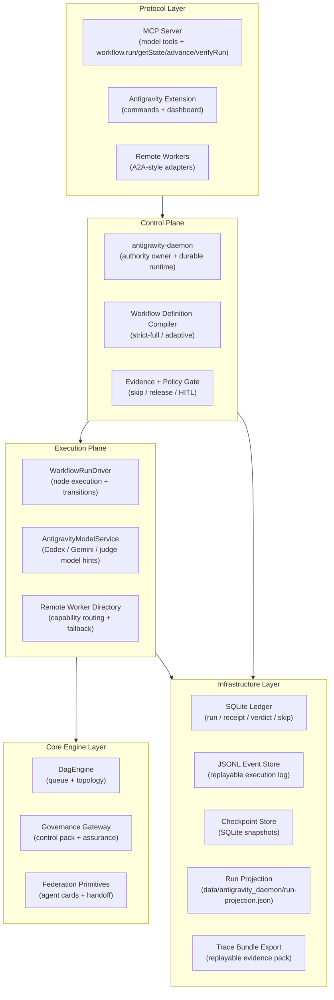

# 🏗️ Architecture — Antigravity Workflow Runtime

## 系统分层

## 运行语义

1. Antigravity 或 MCP 触发 `StartRun`。
2. `antigravity-daemon` 编译 workflow definition，成为唯一 authority owner。
3. `WorkflowRunDriver` 执行节点；远程 worker 只能作为 execution unit，不拥有流程主权。daemon 对远程委派统一支持 `inline`、`poll`、`stream`、`callback` 四种 lifecycle，其中 `callback` 通过独立 callback ingress 接收远端终态结果，并要求 remote worker 使用 `hmac-sha256` 对回调 body 做签名。
4. 每个节点必须产出 receipt；`PARALLEL` / `DEBATE` / `VERIFY` 还必须先经过 remote-first tribunal，policy skip 必须产出 `SkipDecision` 和 skip receipt。
5. release 由 daemon 依据 evidence gate 和 policy pack 决定，必要时进入 `paused_for_human`。
6. 所有状态、timeline、handoff、policy verdict、policy pack 和 trace bundle 都可回放和导出。

## 当前模板

- `antigravity.strict-full`
  7 节点全路径执行，`DEBATE` 不允许跳过。

- `antigravity.adaptive`
  仍然是 7 节点模板，但 `DEBATE` 只有在 `PARALLEL` 结果满足策略条件时才允许进入 `policy_skipped`。

## 核心工程资产

| 模块 | 路径 | 职责 |
|---|---|---|
| Daemon Runtime | `packages/antigravity-daemon/src/runtime.ts` | 权威 run lifecycle、恢复、release gate |
| Tribunal Service | `packages/antigravity-daemon/src/tribunal.ts` | remote-first juror orchestration、quorum、fallback 标记 |
| Run Bootstrap | `packages/antigravity-daemon/src/run-bootstrap.ts` | daemon 自己完成 run 初始化，不再走旧应用服务入口 |
| Workflow Compiler | `packages/antigravity-daemon/src/workflow-definition.ts` | DSL → 7 节点编译图 |
| Evidence Policy | `packages/antigravity-daemon/src/evidence-policy.ts` | receipt / handoff / skip / release evidence |
| Policy Engine | `packages/antigravity-daemon/src/policy-engine.ts` | policy-as-code pack、verdict 生成、scope 级策略 |
| MCP Bridge | `packages/antigravity-mcp-server/src/daemon-bridge.ts` | MCP → daemon 启动与会话桥接 |
| Tool Registry | `packages/antigravity-mcp-server/src/tool-registry.ts` | canonical tool catalog 与域注册 |
| Workflow Run Driver | `packages/antigravity-model-core/src/workflow-run-driver.ts` | 节点推进、条件路由、skip callback |
| Dashboard Panel | `packages/antigravity-vscode/src/dashboard-panel.ts` | Antigravity 面板状态同步 |
| Webview UI | `packages/antigravity-webview/src/components/WorkflowPanel.tsx` | strict/adaptive 启动、timeline、remote worker lifecycle |

## 持久化与观测

- Canonical state 在 SQLite ledger，不在 `run-projection.json`。
- `data/antigravity_daemon/run-projection.json` 只是 projection artifact，供导出、调试和外部集成读取；面板本身直接读取 daemon snapshot。
- step completion protocol 现在持久化为 durable completion session；snapshot/session 的 pending/prepared/acknowledged 由 ledger 中的 completion session 派生，不再靠 timeline latest-kind 推断。
- daemon 重启时会先 reconcile committed/pending/prepared completion sessions，再恢复 drain；`committed but not NODE_COMPLETED` 会自动 replay，stale lease without staged bundle 会回收到 `queued`。
- trace bundle 默认包含 manifest、policy pack、run、events、checkpoints、timeline、receipts、tribunals、handoffs、skip decisions、policy verdicts、remote workers。
- `data/antigravity_daemon/policy-pack.json` 是 workspace 级 policy-as-code 输入源；daemon 启动时自动加载，也支持热重载。
- `data/antigravity_daemon/benchmark-manifest.json` 是 workspace 级 benchmark harness manifest；daemon 运行 benchmark 时按它启用 suite。
- `data/antigravity_daemon/benchmark-dataset.json` 是 workspace 级 benchmark dataset；daemon 运行 benchmark 时按它生成 case-level 结果并回聚到 suite/report，case 既可以编译 workflow definition，也可以回放 trace bundle 做 evidence-backed 校验。
- `data/antigravity_daemon/interop-manifest.json` 是 workspace 级 interop harness manifest；daemon 运行互操作诊断时按它启用 suite。
- remote tribunal worker 使用独立 capability `tribunal-judge`；只有 `mode=remote` 的 tribunal summary 才能满足 release gate，`hybrid` / `local-fallback` 只保留为诊断轨迹。
- daemon 重启后会从 ledger 找回 `starting/running` run 并继续 drain。
