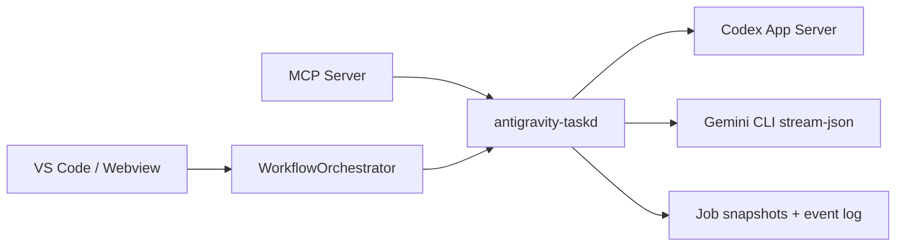

# Architecture

## Main Components

| Component | Path | Responsibility |
|---|---|---|
| Task Kernel | `packages/antigravity-taskd` | 任务创建、分片、调度、事件流、快照、单 writer |
| VS Code Integration | `packages/antigravity-vscode` | 命令、面板、taskd 启动与订阅 |
| MCP Server | `packages/antigravity-mcp-server` | `task.*` 工具注册与桥接 |
| Model Core | `packages/antigravity-model-core` | CLI worker 调用与并行模型能力 |

## Why The Old Runtime Was Removed

旧的 workflow runtime 依赖：

- 固定 workflow 节点
- 节点同步 deadline
- lease / session heartbeat
- 上层等待节点完成后再推进

这套模型会在大项目长分析时产生“CLI 仍在推进，但综述层先超时”的误判。`taskd` 改成统一任务图、语义事件驱动和 `hardBudgetMs`，从架构上移除了这个问题来源。
