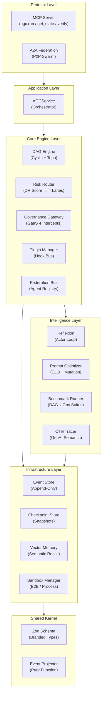
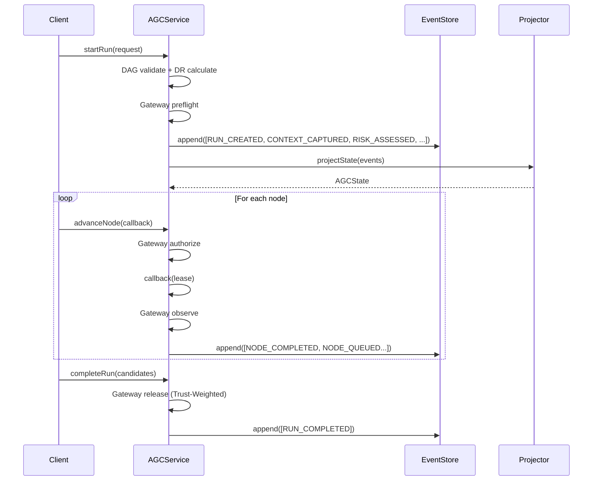
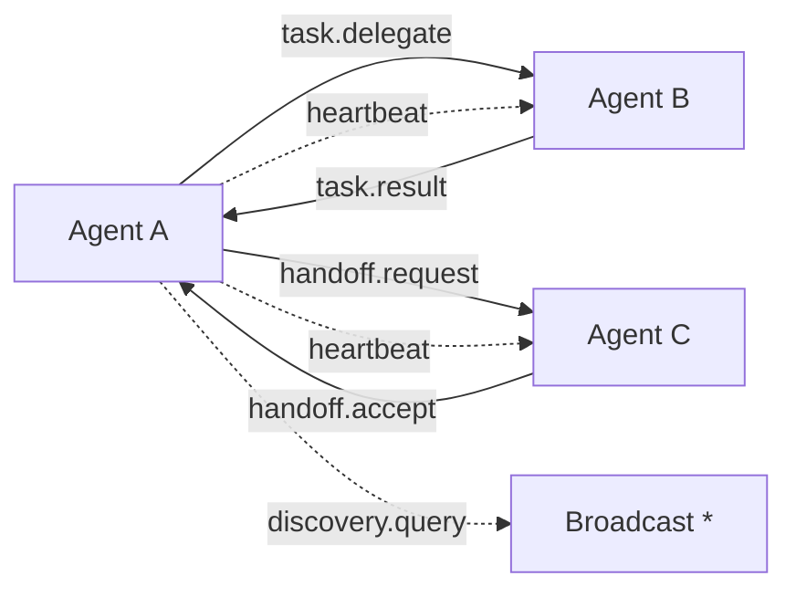

# 🏗️ Architecture — Conductor AGC

## 系统分层



## 17 个模块

| # | 模块 | 路径 | 职责 |
|---|------|------|------|
| 1 | **DAG Engine** | `dag/dag-engine.ts` | Kahn 拓扑排序，节点生命周期管理 |
| 2 | **Cyclic DAG** | `dag/cyclic-dag-engine.ts` | 条件回边 + Tarjan SCC 检测 |
| 3 | **Risk Router** | `risk/dr-calculator.ts` + `risk-router.ts` | DR 分歧率 → 4 级路由 |
| 4 | **Governance Gateway** | `governance/governance-gateway.ts` | GaaS PDP/PEP，4 个拦截点 |
| 5 | **Trust Factor** | `governance/trust-factor.ts` | 信任评分 (风险×合规×模型可靠性×证据) |
| 6 | **Workflow Runtime** | `governance/workflow-runtime.ts` | Lease-Based 执行合同 |
| 7 | **Token Budget** | `governance/token-budget-enforcer.ts` | 双层 Token 预算 (全局+节点) |
| 8 | **Plugin Manager** | `plugin/plugin-manager.ts` | VSCode-style 插件生命周期 |
| 9 | **Hook Bus** | `plugin/hook-bus.ts` | 4 模式 Hook (waterfall/parallel/bail/series) |
| 10 | **Capability Sandbox** | `plugin/capability-sandbox.ts` | Deno-style 权限隔离 |
| 11 | **Isolated Sandbox** | `plugin/isolated-sandbox.ts` | E2B 硬件微 VM 隔离 |
| 12 | **Reflexion Actor** | `reflexion/actor-loop.ts` | 反思闭环 (Trial→Error→Reflect→Retry) |
| 13 | **Federation** | `federation/` | A2A Agent Card + Swarm Router + Message Bus |
| 14 | **Benchmark** | `benchmark/benchmark-runner.ts` | DAG 正确性 + 治理覆盖率评估 |
| 15 | **Prompt Optimizer** | `optimization/prompt-optimizer.ts` | ELO 评分 + 突变策略 |
| 16 | **OTel Tracer** | `observability/dag-tracer.ts` | OpenTelemetry GenAI Semantic Convention |
| 17 | **Collusion Detector** | `collusion/embedding-detector.ts` | 向量余弦相似度串通检测 |

## Event Sourcing 数据流



## 治理网关 4 拦截点

```
请求进入 → preflight (input 控制)
                ↓
         authorize (execution + routing 控制)
                ↓
         [执行节点逻辑]
                ↓
         observe (assurance 控制 + 信任更新)
                ↓
         release (output 控制 + Trust-Weighted 释放)
```

每个拦截点独立评估 GovernanceControl，支持 5 种决策：
- **allow** → 放行
- **warn** → 放行但警告
- **degrade** → 降级执行
- **block** → 阻断
- **escalate** → 上报人工

## Federation P2P 消息模型



10 种消息类型：`task.delegate` / `task.result` / `task.cancel` / `heartbeat` / `heartbeat.ack` / `handoff.request` / `handoff.accept` / `handoff.reject` / `discovery.query` / `discovery.response`

## 技术栈

| 层 | 技术 |
|---|------|
| Language | TypeScript 5.3+ (strict + NodeNext) |
| Schema | Zod 3.24+ |
| Protocol | MCP SDK 1.12+ |
| Testing | Vitest |
| Build | npm Workspaces + tsc + Webpack |
| UI | React + Liquid Glass Design System |
| Observability | OpenTelemetry |
